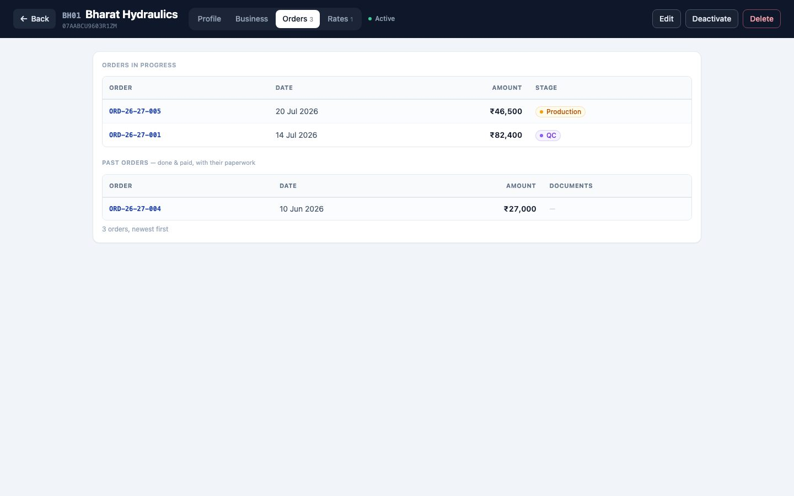
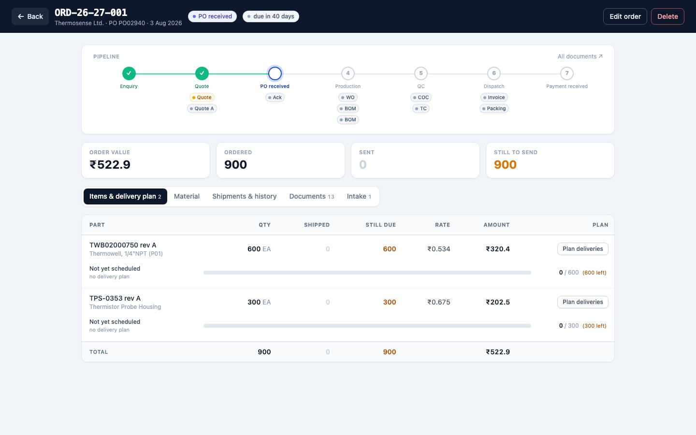
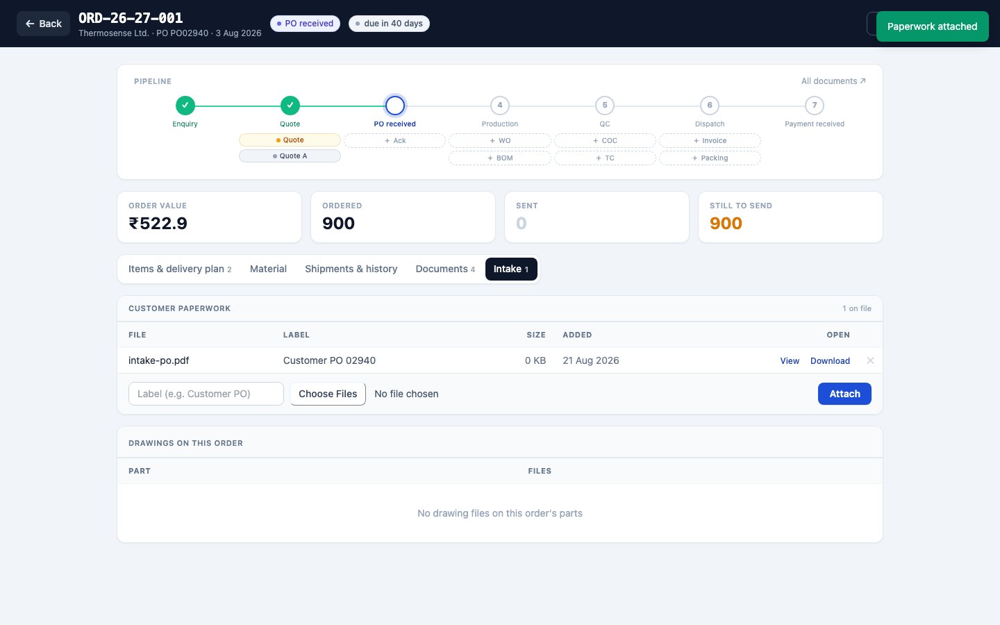
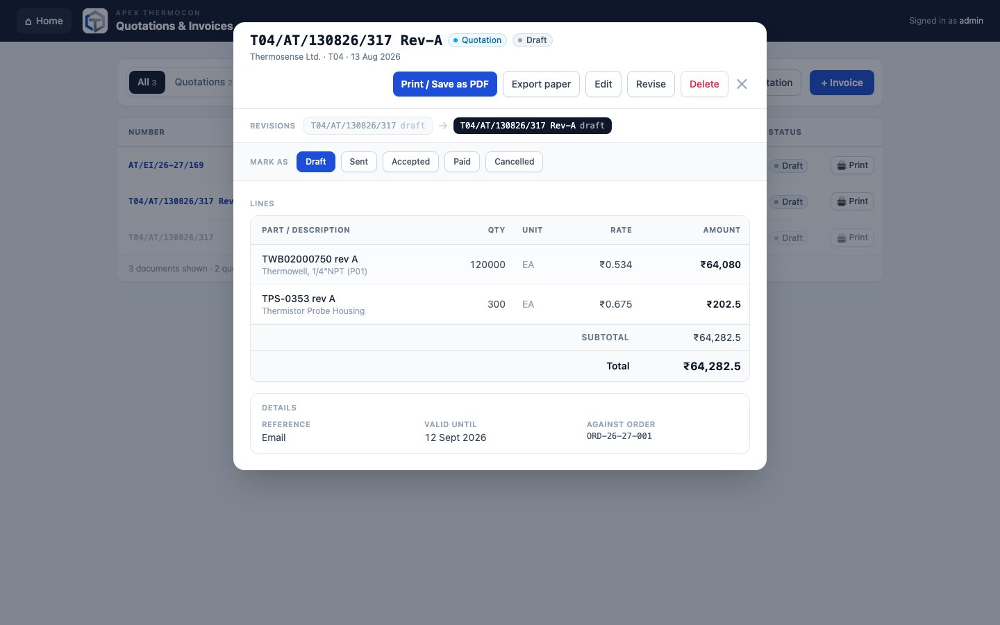
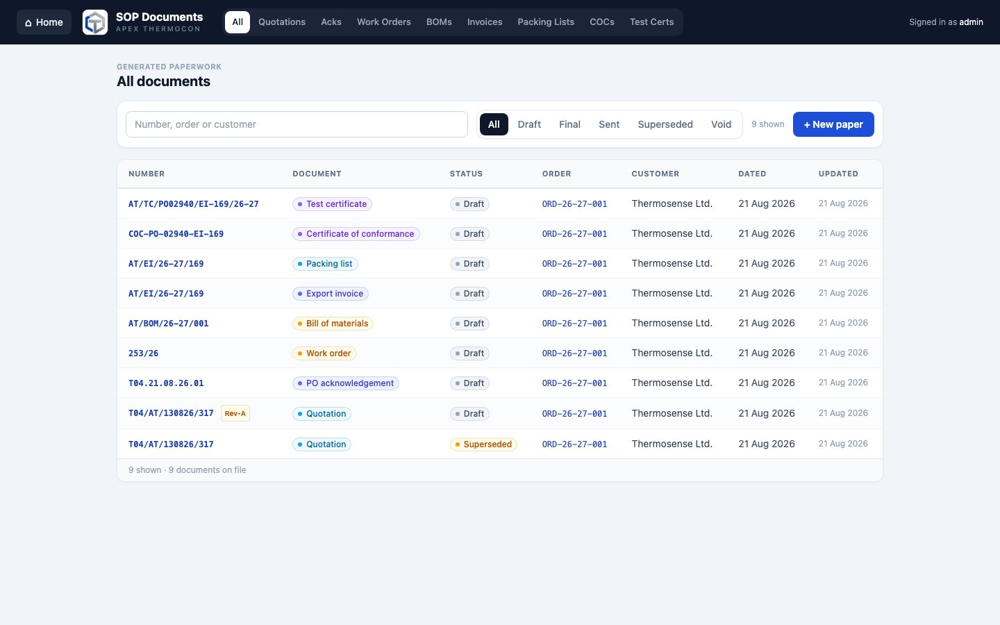
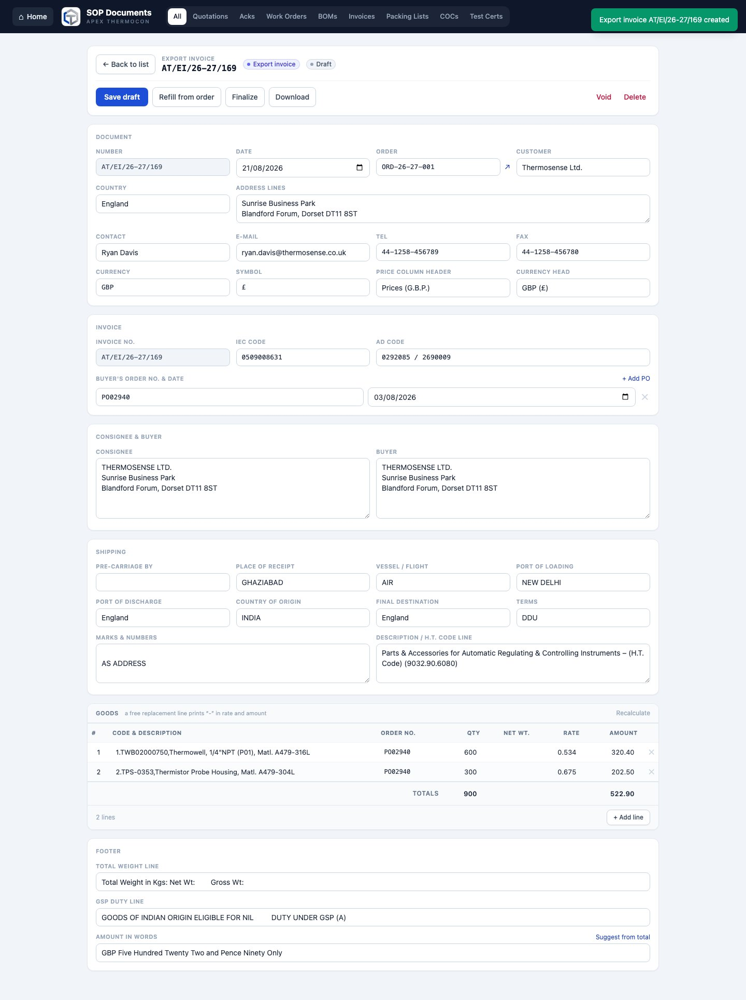
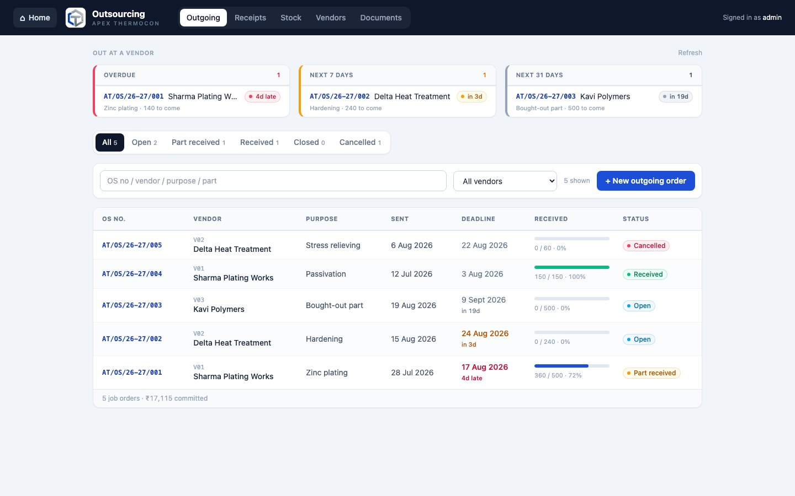
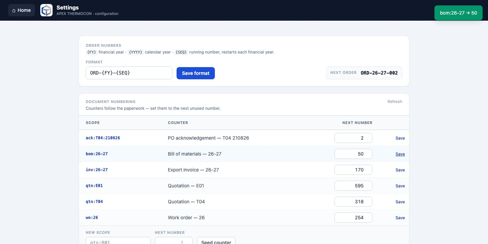

# APEX THERMOCON Workshop — User Guide

A complete guide to using the software, with pictures. Written for the people
who use it every day — no technical knowledge needed. (Screens show sample
data.)

**You can read this inside the app**: sign in and click the **📖 User Guide**
tile on Home, or go straight to `/help/`. It has a contents list down the side
and a search box, and it works with no internet.

The guide is **only available to the owner's account**. If you use the software
day to day and need to know how something works, ask them — they can look it up
for you.

---

## 1. Getting started
<!-- access: general -->

### Opening the app
Double-click **APEX Payroll (Admin).exe** on the main computer, or
**APEX Payroll (Operator).exe** on the attendance laptop. A normal app window
opens — no internet needed.

### Signing in

Type your username and password and press **Sign in**. The app comes with two
accounts:

| Account | Password | Who it's for |
|---|---|---|
| `admin` | `admin123` | The owner — full access to everything |
| `operator` | `operator123` | Attendance entry only |

> ⚠️ **Change these passwords** after first use (section 2). The operator
> laptop signs itself in automatically — it goes straight to attendance.

### Home — your modules

After signing in you land on **Home**. Every box (tile) is one part of the
business — all of them are live. Click a tile to open it; the **⌂ Home**
button at the top-left of any module brings you back.

**The tiles are in the order the work actually happens**, so Home reads like the
shop's own procedure from top to bottom: the job comes in, you quote it, you
confirm it, you make it, you check it, you ship it.

| Tile | What it holds |
|---|---|
| 🗂 **Order Tracking** | Every order, enquiry → quote → PO → production → QC → dispatch → payment |
| 🧾 **Quotations & Invoices** | Quotations, invoices and printable copies for any customer |
| ✓ **PO Acknowledgements** | Order confirmations: what we accepted, and when it ships |
| ⚒ **Production — WO & BOM** | Work orders for the shop floor and their bills of materials |
| ✈ **Shipping — Invoice & Packing** | Export invoices and the packing lists that travel with them |
| ✚ **Quality — COC & Test Certs** | Conformance certificates and heat-wise test certificates |
| 🚚 **Outsourcing** | Vendor jobs, receipts, outsourced stock |
| ⛭ **Raw Material Inventory** | Heat register: rod stock, usage log, mill certificates |
| 📐 **Parts & Pricing** | Drawing master: revisions, rate history, per-operation costing |
| 🏢 **Customers** | Customer master, codes, order history and business growth |
| 👥 **Employee Management** | Profiles, documents, leave bank and employee records |
| ₹ **Salary & Attendance** | Attendance entry, payroll calculation, advances and salary slips |
| ⚙ **Settings** | Order-number format, units, operation rates, departments |

Two more tiles sit at the end for the owner: **Users & Access** and the
**📖 User Guide** you are reading.

The four middle tiles — PO Acknowledgements, Production, Shipping and Quality —
all open the same **SOP Documents** workspace
([section 10](#10-sop-documents--the-paperwork-you-send)), each already filtered
to its own paperwork. They are four separate permissions, so the shop floor can
be given work orders without also seeing invoices.

You only see the tiles your account is allowed to use. Here is what a staff
account with two permissions sees:

### Deadlines coming up

Under the tiles you'll find the **Deadlines** panel — orders whose delivery
dates are close, as three columns: anything already **Overdue** (rose), **Next
7 days** (amber) and **Next 31 days**. Each line names the customer, the order
number and how much of it still has to go out, with how soon as a small chip on
the right. **Click any line and it takes you straight to that order's record**
— the panel is a to-do list, not just a warning.

> Tiles, tabs and section buttons all behave like ordinary web links: <b>right-click
> any of them</b> and choose "Open in new tab" to keep two screens side by side.

An order disappears from the panel once it has been fully sent — nothing left to
deliver is not a deadline. If you have nothing due, the panel doesn't appear at
all. It's only visible to accounts that can open Order Tracking.

---

## 2. Accounts — who can open what
<!-- access: admin -->

*Owner (admin) only.* Open **Users & Access** from Home.

- **+ Add account** — choose a username and password, then either tick
  **Administrator** (full access, like you) or tick just the modules this
  person may open:

- **Edit** — change what an account can open, or set a new password if someone
  forgot theirs.
- **✕** — delete an account. The app refuses to delete the last administrator
  or the account you're signed in with, so you can't lock yourself out.

The paperwork tiles are four separate ticks — **PO Acknowledgements**,
**Production — WO & BOM**, **Shipping — Invoice & Packing** and **Quality — COC
& Test Certs** — plus **Outsourcing**. Tick only what a person needs: someone
who prepares work orders does not have to see export invoices. An
administrator holds all of them without ticking anything.

> ⚠️ **This guide is owner-only.** The **📖 User Guide** tile and `/help/` open
> for administrators and nobody else, whatever else an account is allowed. If a
> member of staff needs to know how a screen works, look it up for them.

---

## 3. Salary & Attendance
<!-- access: salary -->

The monthly rhythm: **operator fills attendance → it syncs to your machine →
you calculate and publish salaries → print the two Excel sheets.**

### 3.1 The dashboard

Quick counts, plus the sections on the left: Pay Setup, Attendance, Advances,
Calculate Salary, View Salaries, Export Slips, Sync/Exchange, Rules.

### 3.2 Pay Setup

The money side of each employee lives here: **base salary, PF/ESI
applicability, and the advance balance** — press *Edit pay* on a row. Click a
name for the full pay story (salary, attendance and advances over time):

> Everything else about a person — adding employees, profiles, documents,
> the leave bank — lives in **Employee Management** (section 4).

### 3.3 Attendance (usually the operator's job)

**All employees** view: one row per employee, one column per day. Everyone
starts as Present (green) — just click days to mark absences (red) and type
overtime hours where earned. Sundays are highlighted; they're paid days off.
**Save all** stores the whole month in one go.

For one person at a time, use the **Single employee** calendar view:

The reminder banner nags until the previous month is complete (due by the 7th).

### 3.4 Getting attendance to your machine (sync)

Both laptops watch a shared folder (Google Drive / Dropbox):
- The **operator** presses *Export attendance* when the month is done.
- On your next sign-in, the app **offers the file with one Yes/No prompt** —
  accept and it's imported (leave banks and penalties recompute automatically).
- When you change the employee list, press *Export roster*; the operator's app
  picks it up silently.

No shared folder configured? The same buttons download/upload files you can
move by pen drive.

### 3.5 Advances

Pick the employee, enter the amount and how it was paid (cheque + cash must add
up), and the ledger updates. Outstanding advances appear automatically in the
salary table and can be recovered at payroll time.

### 3.6 Calculating and publishing salaries

1. Pick the month and press **Prepare** — one row per employee, pre-filled from
   attendance. A ⚠ badge means a penalty rule fired (hover to see which days).
2. Every attendance number is **yours to adjust**: paid days, penalty days,
   OT hours, refreshment days.
3. Use **Set PF for all eligible…** / **Set ESI for all eligible…**, then
   fine-tune individuals. Enter advance recovery (*Adj Adv*) or fresh advances.
4. **Calculate** shows every total. Cash = Total − Cheque automatically.
5. **Publish** locks the month in: salaries recorded, advance ledgers posted,
   your adjustments written back. Re-publishing the same month overwrites it.

### 3.7 History and Excel sheets

**View Salaries** lists any published month. **Export Slips** downloads the two
sheets the office already uses — the CEO reconciliation sheet and the
distribution slip:

### 3.8 Salary rules

Leave entitlement, overtime rate, penalty tiers, the CNC bonus — all live here
and can be changed without touching the program. Careful: this is the raw
policy file; a friendlier Settings screen is planned.

---

## 4. Employee Management
<!-- access: employees -->

Everything about your people that isn't money: profiles, documents, the leave
bank, and attendance summaries. Open the **👥 Employee Management** tile.

### 4.1 The roster

Search by name/department/number, filter by department or **Working / Left**.
Each row shows the shift, joining date, leave scheme and the leave bank.
Click a row to open the full record. **+ Add employee** creates a new person —
with their **bank details** (bank, account number, IFSC — all optional) and the
**documents they hand over on day one** (Aadhaar, agreement, certificates)
attached right from the same form —
profile details plus a one-time *Starting pay* box (afterwards pay is managed
in Salary → Pay Setup).

### 4.2 One employee's record

- **Leave bank** — the **+ / −** buttons add or subtract days (for example a
  compensatory day off, or a correction). The bank can never go below zero.
  Overtime-eligible workers have no bank — their absences follow the penalty
  rules at payroll time.
- **Documents** — upload Aadhaar cards, agreements, certificates (label them,
  then *+ Add files*). Photos from a phone are compressed automatically; click
  a name to view, ⬇ to download. Documents ride along in every backup.
- **Pay** — shown read-only here; change it in Salary → Pay Setup.
- **Attendance** — this financial year's totals and the last six months.
- **Deactivate** marks someone as left; history is always kept and they can be
  reactivated any time.

### 4.3 Editing a profile

Name, department, shift, joining date, and the overtime-eligible flag (this
switches the leave scheme, so change it knowingly).

---

## 5. Raw Material Inventory
<!-- access: inventory -->

Every incoming batch of rods/bars is one **heat** — the number stamped on the
mill test certificate. The app tracks each heat from arrival to the orders it
fed.

### 5.1 The stock list

Top strip: total heats, rods in stock, stock value (₹), rods issued. Each row
shows **remaining/received** with a bar and a status: **In stock**,
**Consumed**, or **Rejected** (returned to supplier). Search by heat number,
grade, supplier or rack; filter by material, shape, status — or find steel by
its chemistry (e.g. Carbon 0.40–0.50%).

### 5.2 Adding incoming material

**+ New heat** opens a **whole screen**, not a small popup — a delivery is
usually a dozen bars across several heat numbers, and that needs room.

On the left, the things true of the whole delivery: date received, supplier,
rack, and the material/grade/shape most of it is. On the right, **one card per
piece**. Press **+ Add piece** for each one, or the ⧉ button to duplicate the
card above when only the heat number changes.

**Supplier** is a dropdown, not a typing box. Pick an existing mill, or choose
**+ Add new…** to enter one — it joins the list from then on, so the same
supplier never ends up spelled three different ways. You can tidy the list in
the **Lists** tab.

**Chemistry per piece.** Press **+ Chemistry** on any card to record that heat's
spectroscopy analysis — element and percentage, as many rows as the report has.
This sits on the piece, not the delivery, because the composition is the whole
reason heat numbers are kept apart. If several cards share one heat number they
share one analysis. The small Composition box on the left is only a fallback for
cards you leave blank.

Elements are picked by their **full name** — start typing "man…" and choose
**Manganese (Mn)** from the list. A name the list doesn't know (a rare-earth
from a special report, say) can be typed as it is.

Each row carries its **own heat number**, and that matters more than anything
else on this screen. Two bars can be the same steel, the same diameter, from the
same lorry, and still be *different metal* — a different heat is a different
melt with a different composition. So the software never merges them: each heat
number becomes its own record and stays that way for good.

| Column | What to put in it |
| --- | --- |
| **Heat number** | Off the mill certificate. Required. |
| **Material / Grade / Sect.** | Leave blank to inherit what you set on the left. **Sect.** is the bar's section — Round, Hexagonal, Square… — and a delivery can mix them; **+ Add new…** learns a section the list doesn't have. |
| **Length** | The actual length of this bar. Required — it is what makes the material check possible. |
| **Ø / A-F** | Diameter for rounds, across-flats for hex, width for flats. |
| **Qty** | How many identical bars of this length. |
| **Note** | Anything worth remembering, e.g. "short offcuts". |

The header keeps a running tally — *3 heat number(s), 4 piece(s)* — so you can
check it against the delivery challan before saving. **Save delivery** records
the whole thing at once: if one heat number turns out to be a duplicate,
nothing at all is saved and you can fix that row.

**The paperwork goes in with the delivery.** The **Paperwork** box on the left
takes the mill test certificates and the receipt or purchase invoice — photos
or PDFs — and attaches them to every heat the delivery creates, so each heat
record carries its own copy. A certificate that belongs to one heat alone goes
in that row's drawer (the same one as its chemistry), under **Files for this
heat**. If a file fails to upload, the delivery is still saved — a message
names the file, and you can add it again from the heat record.

Editing an existing heat still opens the familiar popup, where you can also
correct the piece lengths and diameters.

> If you don't know the lengths, you can still record the heat the old way and
> leave the pieces out. You just won't be able to check it by dimension —
> only by counting bars.

### 5.3 Can we actually make it? — the Material Check

The **Material Check** tab answers the question you ask before promising a
customer anything: *do we have enough steel to make this?*

Fill in the material, the grade, how many parts you need, and the part's length
and diameter. Add a **tolerance / margin** if each part needs a little extra for
parting off and facing. Press **Check availability**.

**How the number is worked out** — this is the important bit. The software
counts the whole parts that come out of *each individual bar*, then adds those
up. It does **not** divide total stock by part size, because offcuts can't be
welded back together.

> Three bars, each 10 long, and you need parts 3 long:
> each bar gives `10 ÷ 3 = 3` whole parts with 1 left over as scrap.
> **3 bars × 3 = 9 parts.** Not 10.

The result is broken down **heat by heat**, so you can see exactly which bars
the job would come off:

| Heat | Length | Pieces | Parts / piece | Parts |
| --- | ---: | ---: | ---: | ---: |
| H1001 | 10 | 1 | 3 | 3 |
| H1002 | 8 | 1 | 2 | 2 |
| H1003 | 6.5 | 2 | 2 | 4 |
| | | | **Total** | **9** |

You also get a status — **Available**, **Partially available** or **Not
available** — with the shortfall if you're short, the leftover on each bar, and
an honest note against any heat whose dimensions were never recorded ("33 rods
on the rack, but no piece dimensions recorded") so nothing quietly disappears
from the answer.

Switch to **By quantity** when the dimensions don't decide it and you just want
to know how many bars are on the rack.

Nothing is reserved. The check only tells you what's possible right now; stock
still leaves the rack through the usage log.

### 5.4 Using stock — the usage log

Open any heat to see its full story. To take rods out:
- **Issued to order** — enter the order/PO number (required) and how many rods.
- **Rejected → supplier** — for bad material; the red **Reject remaining
  batch** button returns everything left in one click.

The app refuses to issue more rods than remain. Deleting a log entry (✕) puts
the rods back — that's also how you undo a rejection.

### 5.5 Tracing an order

The **Usage Log** tab searches every movement by order number — type a PO
number and see exactly which heats (and therefore which mill certificates) fed
that order. That's your traceability answer when a customer asks.

### 5.6 Lists

Material classes, shapes, grades and chemical elements are yours to manage.
Removing a value never changes heats already recorded with it.

---

## 6. Customers
<!-- access: customers -->

Open the **🏢 Customers** tile. One record per customer: GSTIN, billing and
shipping addresses, the country, payment terms, and the people you talk to.

**+ Add customer** creates one; click a row and the customer's record opens as
a **full window** — a Back button top-left takes you to the list. It needs the
room: the record holds their profile, a growth chart, every order and every
document. Editing still opens a small form on top. You add contact persons
(name, role, phone, **fax**, email) there. Customers with orders or drawings
can be **deactivated** but never deleted — history stays intact.

**Country** sits under the two addresses on the form and on the Profile tab.
It is not decoration: it prints in the customer's block on the quotation and
the export invoice, and it decides the currency those documents open in —
England gives pounds, everywhere else gives dollars. Fill it in before you
raise paperwork for an export customer.

**Fax** is a column of its own beside Phone on the contact person, because the
acknowledgement, the invoice and the packing list all print a fax number in
their contact block. A contact with no fax simply shows a dash.

Every customer gets a short **code**: one letter from the name plus a number,
so Thermosense Ltd. becomes **T04** and East Coast Sensors becomes **E01**.
"M/s", "Pvt", "Ltd" and similar words are ignored when the letter is picked.
This is the same code that is printed on the quotation and the acknowledgement
and that their numbers are counted under, so it is worth getting right:

- Type the code you want in the **Customer code** box when you add the
  customer — the hint beside it shows what will be saved. Leave it blank and
  the app takes the first letter and the next free number under it.
- Codes written under the older two-letter scheme (AC01, TS02…) were
  renumbered to this one automatically, once, and nothing else changed.
- After 99 customers under one letter the number simply grows a digit.
- You can search the list by code, name or GSTIN.

> Set each export customer's real code **before** you raise their first
> quotation or acknowledgement. The code is baked into every number those
> documents are given, and Settings counts quotations per code
> ([12.1](#121-document-numbering)).

The record has four tabs.

### 6.1 Business — what they're worth to you

Lifetime total, number of orders, average order value and how much is still
open, then a **month-by-month bar chart** of business won — hover a bar to see
the running total to that month.

The full **Quotations & invoices** list sits below the chart — any past
document can be reprinted from here.

### 6.2 Orders — everything they've ordered, in one tab

Their orders have a tab of their own, so a long history never stretches the
page — the lists scroll inside their own frames. **Orders in progress** is
what's still moving, each with its stage. **Past orders** is the archive —
done and paid — and its Documents column hangs each order's quotations and
invoices on the order itself as small chips: click a chip to print that
document. **Click any order row and you land on the order's full record** in
Order Tracking — this screen is a view of the relationship, not a second copy
of the order.

### 6.3 Rates — the prices you agreed with them

Most customers negotiate their own machining rates. Put them here once and every
part you price for that customer uses them automatically.

Pick the **Operation**, type **Their ₹/hour** (what this customer pays for it),
optionally an **Additional ₹/hour** on top, add a note like *"agreed Apr 2026"*
so you remember when it was settled, and press **Save rate**. The standard shop rate
from Settings sits greyed out in the **Standard ₹/hr** column beside it, so you
can see at a glance what was negotiated.

- The **effective rate** is *their ₹/hour + additional ₹/hour*. In the picture,
  ₹520 + ₹30 = **₹550/hour**.
- Saving the same operation again updates it — you never get duplicate rows.
- Changing a rate here reprices every future costing for that customer in one
  edit. Costings you already saved keep the price they were saved with.

---

## 7. Parts & Pricing
<!-- access: parts -->

Open the **📐 Parts & Pricing** tile — one record per customer drawing.

- **Drawing number + revision** identify the part; **+ Revision** starts a new
  revision (its rates and files begin fresh — pricing history is per revision).
- **Drawing files** — attach the PDF or a scan, **right in the New drawing form**
  or later from the record.
- **Overall length / width (mm)** — the finished part's envelope, straight off
  the drawing. Optional; shows as *120 × 40 mm* on the record and carries over
  to new revisions.
- **Part type** — a broad family name like *Shaft*, *Flange* or *Adapter*. The
  box offers every type you've used before; typing a new one adds it to the
  list the moment you save. It shows as a small tag in the list and is
  searchable, so "impeller" finds every impeller you've ever drawn.
- **Rate history** answers "what did we charge last time": dated entries marked
  **quoted / agreed / revised**, newest first. The latest rate shows on the
  list and auto-fills order items.
- **Customer** — assign the drawing to a customer here. This is what makes the
  costing screen use that customer's agreed rates.

### 7.1 The costing workspace

**Open costing workspace** on a drawing gives pricing a full screen of its own.

The part, its customer and its rate history sit on the left; the operations
table is on the right. Switch revisions with the **A / B** buttons at the top
right — each revision is priced separately.

Add a row per operation with **+ Add operation**, then fill in:

| Column | What to put in it |
| --- | --- |
| **Operation** | Pick from your Settings list. The rates fill in by themselves. |
| **Minutes** | Minutes this operation takes **per piece**. |
| **₹ / hour** | The hourly rate. Comes from Settings, or from the customer's agreed rate if they have one. |
| **Add'l ₹/hour** | Extra rupees per hour for this one operation — a better machine, a tighter tolerance, an awkward setup. |
| **Effective ₹/hr** | Calculated: ₹/hour + additional ₹/hour. Not editable. |
| **Weightage** | How much this operation counts relative to its clock time. Leave blank for normal (1). |
| **Row ₹** | Calculated: `minutes ÷ 60 × effective ₹/hr × weightage`. |

Everything recalculates as you type — there is no "calculate" button.

> **The additional margin is rupees per hour, not a percentage.** ₹520/hour with
> ₹30 additional means you are charging **₹550 an hour**, so 12 minutes costs
> ₹110. It sits in the same units as the rate next to it, so the two numbers are
> directly comparable.

**Weightage** is for work that is worth more than the stopwatch says. Setup time
spread across a batch, a second spindle running at the same time, an allowance
for scrap — put 1.5 and the row bills at one and a half times.

When the drawing belongs to a customer who has agreed rates, the row shows a
green **★ *customer* rate** badge and uses their price instead of the shop
standard. No badge means it's the standard Settings rate.

Below the table, add **material cost per piece** and an **overall margin %**;
the build-up on the right shows operations → + material → + margin → the final
₹/piece. **Save costing** stores it against the revision, and from the drawing
you can then push it into the rate history with **→ quote** or **→ agreed**.

A saved costing keeps the rates it was saved with. Changing a rate in Settings
or on the customer later will never quietly change a price you already quoted.

### 7.2 Bill of materials — pricing the steel from stock

You no longer have to remember what the bar cost. **+ Add material** in the
costing workspace searches your inventory:

Type a **heat number**, a **grade** (EN8), a **material** (Stainless Steel) or a
**supplier** — one box searches all of them. Each result shows what's left on the
rack and what that steel cost per rod (or per kg), worked out from the purchase
price you recorded when it came in.

Pick one and it becomes a line in the bill of materials. Then fill in the one
number only you know: **how many parts come out of one rod**. The cost per piece
follows:

> A rod cost ₹4,500 and yields 3 parts → **₹1,500 of material in every piece.**

Add as many lines as the part needs. The **Material per piece** total feeds
straight into the costing, and while a bill of materials exists the manual
"Material cost" box is greyed out — one number, one source, so the two can never
disagree.

Like the operation rates, the prices are **frozen into the costing when you
save**. If that steel costs more next month, the quote you already sent doesn't
change underneath you.

---

## 8. Order Tracking
<!-- access: orders -->

Open the **🗂 Order Tracking** tile. It has three tabs: **Orders**,
**Consignments** and **Shipments**.

Clicking an order opens it as a **full window** with a Back button — an order
carries its items, its delivery plan, its shipments and its stage history, which
is more than a popup can hold. **New order** and **Edit** both fill the screen
the same way.

- **New order** — pick the customer, note their PO number, add items (picking
  a drawing fills the unit and its latest rate). The order number is automatic
  (format set in Settings) and restarts every financial year.
- **Deadline** — the date the whole order must be with the customer. It shows as
  a column on the list, turning **amber inside a week** and **red once overdue**,
  and it drives the warning panel on Home.
- **Stages** — Enquiry → Quote → PO received → Production → QC → Dispatch →
  Payment received. Click any stage to move there (skipping is fine); every
  move is logged with a note.
- **Material used** — rods issued in Inventory against this order number
  appear automatically, with their heat numbers: order → heat → mill
  certificate, the full traceability chain.
- **Documents** — this tab lists every quotation and invoice raised against
  this order, with its status, total and a **Print** button; the document
  number links into Quotations & Invoices. Under it, **SOP documents** lists
  the export paperwork — acknowledgement, work order, invoice and the rest —
  each with a **Download** link ([section 10](#10-sop-documents--the-paperwork-you-send)).
- **Shipping (consignments)** — press **🚚 Ship**:

  Enter the GST paperwork (transporter, LR number, e-way bill, invoice,
  vehicle, freight) and the quantities going on this truck. **Partial
  shipments are fine**, and one consignment can carry items from **several
  orders** (type another order number and press *Add order*). The app refuses
  to ship more than an item has left. The **Consignments** tab lists every
  shipment — mark them **Delivered ✓** when confirmed.

### 8.1 The pipeline — where the job is, and what paper it still needs

Across the top of every order record sits the **Pipeline** strip: the seven
stages of the job, left to right, with the paperwork for each one hanging
underneath it.

**The circles are the stages.** A stage the order has passed shows a green
tick, the stage it is on now is ringed in blue, and the ones still to come are
grey numbers. Click any circle to move the order there — it asks for a note
first, and skipping ahead is fine. This is the same stage list as before; the
strip is just a clearer way to look at it.

**The small chips under a stage are its documents.** Each one is a real
document that has been raised against this order, and clicking it opens that
document. The colour tells you where it has got to:

| Chip | Meaning |
|---|---|
| Grey | A draft — still being written |
| Green | Finalised — frozen, ready to send |
| Blue | Sent to the customer |
| Amber | Superseded by a newer revision |
| Dashed outline with a **＋** | Nothing raised yet — click to start it |

A chip carrying a letter (**Invoice A**, **Quote A**) is a revision. Hover any
chip and it tells you the full number and its status.

**The ＋ chips are how you start a document.** A dashed **＋ Ack** under *PO
received* means this order has no acknowledgement yet; click it and the new-
document form opens with the kind and the order already chosen, so there is
nothing to look up. The chips sit under the stage the document belongs to:

| Stage | Documents |
|---|---|
| Quote | Quotation |
| PO received | Acknowledgement |
| Production | Work order, Bill of materials |
| QC | Certificate of conformance, Test certificate |
| Dispatch | Export invoice, Packing list |

Enquiry and Payment received carry no paperwork of their own. A document you
void disappears from the strip and its **＋** comes back, because as far as the
job is concerned that paper was never issued.

**All documents ↗** at the top right of the strip opens the whole SOP
Documents workspace ([section 10](#10-sop-documents--the-paperwork-you-send)).

### 8.2 Intake — the customer's own paperwork

The **Intake** tab is where the order's incoming paper lives: the enquiry
e-mail, the customer's purchase order, a marked-up drawing they sent, the
screenshot of a WhatsApp message that started the job.

**Customer paperwork** — type a **Label** ("Customer PO", "Enquiry e-mail"),
choose one file or several, and press **Attach**. Each row then shows the file
name, its label, its size and the day it went on, with **View** to open it in a
tab and **Download** to save a copy. The ✕ removes one (it asks first).

Anything attached here rides along in every backup, exactly like inventory
certificates and employee documents.

**Drawings on this order** underneath is not an upload box — it is a
convenience. It lists each item's drawing files straight from Parts & Pricing,
so the person looking at the order can open the drawing without going to find
it. Parts with no drawing file on record say so.

### 8.3 What material this order needs

Under the items you'll find **Bill of materials — what this order commits**.

The order doesn't have its own material list; its *parts* do. So the app takes
each item, looks up that drawing's latest costing, and multiplies the material
per piece by how many you've ordered — then adds it up by heat number, because
the heat is what actually has to come off the rack.

> 60 shafts, and the costing says one rod makes 3 → **20 rods of H1001, ₹90,000.**

Next to each line you'll see what has already been **issued** against this order
number in Inventory, and what is **still to issue**. So one table answers both
"what does this job need?" and "how much of it have we taken out?".

A line in grey under the table means an item couldn't contribute — it has no
drawing, its drawing has no costing yet, or that costing has its material cost
typed in by hand instead of picked from stock. It says which, so you know what to
fix rather than wondering why a number looks low. If a heat was issued to this
order that no part on it calls for, that's flagged in amber.

#### Issuing it to the store

**📄 Issue requisition** turns that list into a real document — its own number
(MRQ-26-27-001, restarting each financial year), and it opens ready to print.

It shows each heat with **Required**, **Already issued** and **To issue now**,
the committed value, and lines to sign: issued by, store keeper, received by.
Print it or Save as PDF — no internet, nothing to install.

> The figures are **frozen** the moment you issue it. If someone re-costs the
> drawing tomorrow, this sheet does not change — you issue a new one. That is
> deliberate: paper already on the shop floor must mean what it said when it
> was handed over.

Every requisition you've issued for an order is listed underneath it, so you can
reprint any of them later.

### 8.4 Planning a long order

Some orders run for months and go out in instalments. Press **Plan** on any item
to say when each part of it is due:

> An order for 600 pieces: 250 by 15 September, 100 by 15 October, and the
> remaining 250 before the deadline.

Add a line per drop. The **+ Remaining (N) by the deadline** button writes that
last line for you, using the order's own deadline. The panel keeps three figures
in view — **Ordered**, **Planned** and **Not planned yet** — and the last one is
worked out for you, so it can never disagree with the others. You can't plan more
than the item quantity; the app will say so.

Once the plan is saved, the **Items & delivery plan** tab draws it: under the
item, one bar per drop with its date, how much of it has gone and how much is
left. The button on the row turns into **Edit N drop(s)**.

The last bar is often **Not yet scheduled** — the quantity you haven't promised a
date for. It is shown in a softer colour, because it is quantity you still owe
but haven't committed to a day for.

### 8.5 Sending it out, drop by drop

The **Shipments & history** tab shows the order broken into the deliveries you
planned, each with its own progress bar and its own **🚚 Ship this** button.

Press it and the consignment form opens with that part already chosen and that
drop's outstanding quantity filled in — you only have to add the lorry details.

> **Sending more than planned is fine.** If a drop was for 250 and you send 300,
> that drop closes and the extra 50 counts towards the next one, which now needs
> 100 instead of 150. You never have to go back and rewrite the plan.

A completed drop turns green and loses its button. If you send more than the
whole plan accounts for, a note tells you so. **Ship something else** is there
for a mixed lorry carrying several orders, or a part with no plan at all.

### 8.6 Shipments — what do we still owe?

The **Shipments** tab is the answer to *"how much of this order is still to go?"*

One row per order: how much was **ordered**, how much has been **sent** and how
much **remains**. "Sent" counts every consignment ever raised against that order,
so an order delivered in six lorries over four months adds up correctly.

The **Deliveries** column is not one bar — it is one bar *per drop*, each as wide
as the quantity it covers. An order for 600 sent as 200 + 250 + 150 draws three
bars: the first full and green, the second part filled, the third empty. One
averaged bar would say "62%" and hide the fact that the last delivery hasn't
started.

Click the **▸** beside the order number to write those deliveries out in full,
with their dates, their notes and how much each still owes. Click anywhere else
on the row to open the order.

By default you only see orders that still owe something — untick the box to
include the finished ones. The figure at the bottom is everything still
outstanding across the orders shown.

---

## 9. Quotations & Invoices
<!-- access: quotations -->

Open the **🧾 Quotations & Invoices** tile. Both live here — a quotation is what
you send before the work, an invoice is what you send after it.

**+ Quotation** or **+ Invoice** opens a full screen — and so does **Edit**:
a document has too many lines to work on comfortably in a popup. Choose the
customer and their details fill in. Add a line per item: description, quantity,
rate — the amount, subtotal, GST and grand total all calculate themselves. For
an invoice you can pick an **order** instead and its items are copied in for
you, so you are not retyping what you already entered in Order Tracking.

Document numbers are issued automatically and quotations and invoices are
numbered in separate series — a new quotation now takes the real export number
for that customer (`T04/AT/210826/317`), an invoice the export invoice number
(`AT/EI/26-27/169`). Those series are counted in Settings
([12.1](#121-document-numbering)).

Rates carry **three decimals** here, because export prices are quoted that way —
£0.534 a piece is a real price, and rounding it to £0.53 changes the value of a
120,000-piece line by sixty pounds. Line totals still show two.

### 9.1 Checking material before you commit

While writing a quotation you can tick **☐ Check material availability**.

It is entirely optional and off unless you tick it — the quotation is written
and saved exactly as before either way. Ticking it opens the same check
described in [5.3](#53-can-we-actually-make-it--the-material-check), with the
quantity already filled in from your quotation lines. Fill in the part length,
diameter and any margin, press **Check stock**, and you get the same heat-wise
answer right there in the form.

The point is to find out you're short *before* you promise a date, not after.
Nothing is reserved and the check never stops you saving — a shortage is
information, not a blocker. The same checkbox is on the new-order screen.

### 9.2 Printing and sending

**Print** opens a clean A4 copy in a new tab.

From there use your browser's print dialog — choose your printer for a paper
copy, or **Save as PDF** to get a file you can email or put on WhatsApp. There
is nothing extra to install.

Every document stays on the customer's **Business** tab too, so you can reprint
any past quotation or invoice from there at any time.

### 9.3 Revising a quotation

A customer comes back and asks for a better price, or for 500 instead of 600.
You do not write a second quotation and you do not overwrite the first. Open the
quotation and press **Revise**.

A new draft opens as **the same number with `Rev-A` after it** —
`T04/AT/210826/317 Rev-A`. Change what needs changing and send it. Revise that
one and you get `Rev-B`, and so on.

The one it replaced becomes **superseded**: it stays in the list, greyed out with
a small *superseded* tag, so you can always see what you quoted first and when
you changed it. It cannot be revised again — you always revise the newest one.
The **Revisions** line at the top of an open quotation shows the whole chain,
original → Rev-A → Rev-B, and you can click back to any of them.

### 9.4 The export copy — Export paper

**Export paper** on an open quotation or invoice takes you to the same document
in the company's own export format — the quotation sheet you actually e-mail,
or the export invoice. The first press builds it; every press after that opens
the one you already have.

That document lives in the SOP Documents workspace
([section 10](#10-sop-documents--the-paperwork-you-send)), where you finish it
off and download it. The quotation here is the money record — what was
quoted, to whom, for how much; the export copy is the piece of paper the
customer receives.

> A document must be against an order before it can have an export copy — the
> paperwork hangs off the job. If **Export paper** says so, link the document to
> its order first.

---

## 10. SOP Documents — the paperwork you send
<!-- access: acks -->

Every job produces the same run of paperwork: you quote it, you confirm the
purchase order, you write a work order for the floor, you list the material, you
invoice it, you pack it, you certify it. All of it is here, in one workspace,
in the company's own formats — the same sheets the office has always sent, filled
in for you instead of typed again.

Four tiles on Home open this workspace, each already filtered: **PO
Acknowledgements**, **Production — WO & BOM**, **Shipping — Invoice & Packing**
and **Quality — COC & Test Certs**. They are the same screen; the tile just
decides what you land on.

### 10.1 The eight documents

| Document | What it is for |
|---|---|
| **Quotation** | The price you offer, in export format, before the order exists |
| **PO acknowledgement** | Your written confirmation of their purchase order — what you accepted, at what price, and the date you promise to ship |
| **Work order** | The shop-floor instruction: which parts, how many, what material, what marking |
| **Bill of materials** | What the job consumes — heat by heat, plus anything bought out |
| **Export invoice** | The bill that travels with the goods, with the shipping and customs blocks |
| **Packing list** | The same shipment written box by box, with weights |
| **Certificate of conformance** | Your signed statement that the parts meet the order |
| **Test certificate** | The material proof: heat numbers and their chemistry, line by line |

### 10.2 The list

Across the top: **All**, then one tab per document — Quotations, Acks, Work
Orders, BOMs, Invoices, Packing Lists, COCs, Test Certs. Under that, a search box that
matches the number, the order or the customer, and a row of state buttons —
**All · Draft · Final · Sent · Superseded · Void**.

Each line shows the number, what kind of document it is, its state, the order
and customer it belongs to, and the two dates. Click the order number to jump to
the order; click anywhere else to open the document. A **Rev-A** badge beside a
number means it is a revision.

**+ New paper** starts one from scratch: choose which document you want, find
the order, and answer the one question that document needs (which quotation,
which invoice). Most of the time you will not need it — the **＋** chips on the
order's pipeline strip
([8.1](#81-the-pipeline--where-the-job-is-and-what-paper-it-still-needs)) start
the same form with the answers already filled in.

### 10.3 The form

Documents open as a **full page**, never a popup — an export invoice has more
boxes than a popup can hold.

Everything on the sheet is a box you can type in. Nothing is locked. The app
fills it all in when the document is created — from the order, the customer, the
quotation, the heat register — and then it is yours: change a description,
correct an address, add a line, delete one.

The row of buttons at the top is the same on every document:

| Button | What it does |
|---|---|
| **Save draft** | Keeps your changes |
| **Refill from order** | Throws your changes away and rebuilds the document from the order as it stands today |
| **Finalize** | Freezes it — see below |
| **Mark sent** | Records that it went to the customer |
| **Revise** | Opens a new draft as Rev-A, and marks this one superseded |
| **Download** | Gives you the real Excel or Word file |
| **Void** | Cancels the document |

**The five states.** A **draft** is being written and can be edited, refilled or
deleted. **Finalize** freezes it: it can still be downloaded and sent, but the
words on it will not change again — which is the point, because a finalised
sheet is what left the building. **Sent** records that the customer has it.
**Revise** on a final or sent document opens a fresh draft with the same number
plus a revision letter and marks the old one **superseded**. **Void** cancels a
document you should never have raised.

> The number is spent the moment the document is created. Voiding it does not
> give the number back and neither does deleting a draft — a number that has
> been handed out is never handed out twice. That is deliberate: gaps in a
> numbered series are normal, a repeated number is a problem.

**Refill from order** is the button to reach for when the order changed after
you started the document — the customer added a line, you corrected the
quantity. It asks first, because it replaces anything you typed by hand. It
never runs on its own, and it never changes the number.

**Download** builds the file there and then and gives it to you named the way the
office names them, for example `COC-PO-02940-EI-169.docx`. Nothing is stored
half-finished on disk, so a document you download today reflects what is on the
screen today.

### 10.4 Notes on particular documents

Most of the form explains itself. A few places behave in a way worth knowing.

**The export invoice bills several purchase orders at once.** Under *Buyer's
order no. & date* press **+ Add PO** for each one, with its date. That is
normal for a regular customer: one shipment clears six of their POs. Each goods
line also carries its own **Order no.**, so the customer can see which of their
POs each part belongs to.

**Free replacements print a dash.** On a goods line you are not charging for —
a part sent to replace a rejected one — put a `-` in **Rate** and **Amount**
instead of a figure. It prints as a dash and the line is left out of the
quantity, weight and money totals, which is exactly how the office has always
shown replacements.

**The packing list is grouped into boxes.** It starts as one box holding
everything. **+ Add box** makes another, and its header takes the box number,
the size (`16" x 11" x 10"`), the net weight and the gross weight. To move a
part into another box, use the **Move to** dropdown on its line and pick the
box — the line jumps across immediately. **Remove box** deletes a box and its
lines fall back into the first one, so nothing is lost. **Recalculate totals**
adds the quantities back up after you have moved things around.

**The test certificate carries the chemistry.** Each line is one part off one
heat, and the eight standard columns — C, Mn, Si, P, S, Cr, Ni, Mo — are filled
from that heat's analysis in the inventory record. A steel with an element
outside those eight (copper, titanium) uses the five **Extra element columns**
above the grid: name a spare column and every line fills in that element's
percentage. Unnamed spare columns print a dash. Get the chemistry into the heat
record when the material arrives ([5.2](#52-adding-incoming-material)) and this
sheet writes itself.

**The bill of materials names the source of every line.** The **Heat / OS ID**
column carries the heat number for steel off your own rack, or the **OS-0001**
identity of a part you bought out; the **Source** column then reads *In-House*
or *Outsourced - V01* with the vendor's code. One glance answers "did we make
this or buy it?" — which is the question a customer audit asks.

### 10.5 Raising a job's paperwork, in order

The pipeline strip on the order ([8.1](#81-the-pipeline--where-the-job-is-and-what-paper-it-still-needs))
walks you through this: at every stage the ＋ chips show what is still missing.

**1. The quotation.** Write it in Quotations & Invoices as usual, then press
**Export paper** ([9.4](#94-the-export-copy--export-paper)) to get the export
sheet. If the customer comes back, **Revise** it.

**2. The acknowledgement**, once their purchase order arrives. Its **Quotation
ref.** is the quotation you are confirming — pick it, or press the **Repeat PO**
button beside the box, which types the literal words *Repeat PO* into it. That
is what the office writes when a customer simply re-orders against a price
already given, and it prints on the sheet exactly like that. Fill in their PO
number and date, check the **Ship date** you are promising, and finalise it.

**3. The work order**, for the floor. It **reuses the number the
acknowledgement already reserved** — `253/26` — so the confirmation you sent the
customer and the paper on the shop floor carry the same job number. Raise the
acknowledgement first and the work order needs no thought; the number is filled
in and read-only.

**4. The bill of materials.** Built from the order's parts, their costings and
the heats those costings price, with anything bought out named by its OS ID.

**5. The export invoice**, when the goods are ready. To put **several orders for
one customer** on one invoice, add the extra order numbers under *Also bill
these orders* on the new-document form — their lines are merged and each keeps
its own PO number. All the orders must be for the same customer; the app says so
if one is not.

**6. The packing list, the certificate of conformance and the test
certificate** all hang off the invoice: raise the invoice first, then pick it
when you start each of them. The packing list takes the invoice's number, the
COC quotes the PO and the invoice, and the test certificate pulls the heats that
were issued to the order and their chemistry.

---

## 11. Outsourcing — work you send out
<!-- access: outsourcing -->

Plating, heat treatment, a bought-out part — work that leaves the shop and has
to come back. Open the **🚚 Outsourcing** tile. Five tabs: **Outgoing**,
**Receipts**, **Stock**, **Vendors** and **Documents**.

### 11.1 Outgoing — what is at a vendor right now

The strip at the top, **Out at a vendor**, is the chasing list: **Overdue**,
**Next 7 days** and **Next 31 days**, exactly like the deadline panel on Home
but counting the dates you gave your vendors. Each line names the job, the
vendor, what it is for and how much is still to come; click it to open the job.
A job that is fully back, closed or cancelled leaves the strip — it is not a
deadline any more. Nothing due, no strip.

> These deadlines only appear here, not on Home. Home watches customer orders;
> this watches vendors.

Below it, the jobs themselves — filtered by state (**Open**, **Part received**,
**Received**, **Closed**, **Cancelled**), searchable by job number, vendor,
purpose or part. Each row shows how much has come back as a bar, and the
deadline turns amber inside a week and red once late.

**+ New outgoing order** raises one. Pick the vendor (or add one on the spot),
say what it is for, set the date sent and the deadline, and list what is going:
description, part code, quantity, unit and the vendor's rate. Link it to a
customer order and you can send **part of that order** out — pick the items and
the quantities, so half a batch can go to one plater and half to another.

The job gets a number of its own — `AT/OS/26-27/001` — and its record shows
**Sent out**, **Back**, **Still out** and the job's value, with tabs for its
lines, its receipts and its paperwork.

**Open, part received and received look after themselves** — they follow what
has actually come back. **Close** and **Cancel** are yours to press: Close when
nothing more is expected even though the numbers do not add up, Cancel when the
job is off.

### 11.2 Booking in what comes back

**📦 Record receipt** on the job order. The form lists every line still
outstanding with the missing quantity already filled in:

- **Received on** — the day it actually came back, not the day you type it.
- **Inspection notes** and the **Accepted** tick — what the check found. An
  unticked box records a rejected delivery; the goods are still booked in, so
  what you are recording is the judgement, not the quantity.
- **Received now** — change it if only part of the line came.
- **Into stock** — leave it on **New OS ID** and the goods become a new
  outsourced stock item, numbered `OS-0001`, `OS-0002`… Choose an existing OS ID
  instead when this is more of something you already hold, and it tops that up.
- **Rate** — the vendor's price per piece, which follows the goods into stock so
  a costing can use it later. It is greyed out when you are topping up existing
  stock: an old shelf is not repriced by a new delivery.

You cannot book in more than the line has outstanding. Deleting a receipt undoes
it — the stock goes back out again, dated the day the delivery was, so every
balance from that day on reads as if it never arrived. The stock record keeps
both entries: what came in, and the correction that took it away again.

The **Receipts** tab of the workspace is every delivery from every vendor in one
list — date, job, vendor, how many lines, the quantity, the inspection note and
whether it was accepted, with the count of rejected ones at the foot. That is
where you look when the question is about a vendor's quality rather than about
one job.

### 11.3 Reopening a job you closed too soon

Someone pressed **Close** on Friday and the last 40 pieces turned up on Monday.
Open the job and press **Reopen**. The job goes straight back to following the
quantities: if everything is now back it reads *Received*, if some is still out
it reads *Part received*, and if nothing came it goes back to *Open*. Its
deadline reappears on the strip.

You cannot reopen a job that was never closed — a live job is already following
the numbers.

### 11.4 Outsourced stock

The **Stock** tab is the shelf of bought-out and returned parts: one line per
**OS ID** with its description, part code, material and size, how many are on
hand, what they cost, which vendor they came from and which job brought them in.

Open one and you get **Issue** (to a job — the order number is required, exactly
like issuing rods), **Adjust** (a signed correction: negative to write stock off,
positive when a piece turns up, and it insists on a reason) and **Edit** for the
description and the rest. There is no quantity box to type into: stock only ever
moves by a receipt, an issue or an adjustment, and every one of them is listed
underneath with its date, its sign and its remark. The line under the table —
*they add up to N on hand* — is the proof that the log and the shelf agree.

These items show up in the material search when you cost a part or write a
quotation, marked as outsourced with the vendor's name, alongside your own heats.
On a bill of materials they print their OS ID and *Outsourced - V01*
([10.4](#104-notes-on-particular-documents)).

### 11.5 Vendors and their paperwork

**Vendors** is the list: code, name, what they do for you, contact, how many
jobs are open with them and how much of their stock you hold. Each gets a code
— **V01**, **V02** — assigned automatically unless you type one. Open a vendor
for their profile, every job you have sent them, their paperwork and the stock
that came from them. Vendors can be deactivated but not deleted.

**Documents** is where vendor paperwork is filed: their challan, their invoice,
their rate card, a photo of a job sheet. Choose the vendor or the job (or both),
give it a label and add the files — images or PDFs, photos shrunk automatically.
The same **+ Add files** box sits on a vendor's record and on a job order.

> Vendor paperwork is **filed, not generated**. The app does not produce
> documents for vendors; it keeps the ones they send you, in the backup, where
> you can find them.

---

## 12. Settings
<!-- access: settings -->

Open the **⚙ Settings** tile (changes are owner/admin only).

- **Order numbers** — the format template (`{FY}` financial year, `{SEQ}`
  running number) with a live preview of the next number.
- **Units** — the searchable list every unit dropdown uses.
- **Machining operations & hourly rates** — what the Parts costing builder
  charges per hour. Changing a rate affects new costings only.
- **Departments** — shared with employees and payroll.
- **Document numbering** — every paperwork counter in the business, below.

### 12.1 Document numbering

A **counter** is one running number: the quotations you send Thermosense, the
acknowledgements you wrote today for East Coast Sensors, this year's export
invoices. Every kind of document keeps its own, and the card lists each one with
the **next number** it will hand out. Type over that number and press **Save**.

There is one job to do here **before you raise your first real document**: set
each counter to the number the office has actually reached. Otherwise the app
starts at 1 and your next invoice goes out as `AT/EI/26-27/001` when the file
says 169.

Four are already set from the last documents on file:

| Counter | Set to |
|---|---|
| Quotations for T04 | 317 |
| Quotations for E01 | 595 |
| Work orders, 2026 | 253 |
| Export invoices, 26-27 | 169 |

Counters appear on their own as soon as the first document of that kind is
raised, so the card starts short and grows. To get ahead of one — a new export
customer whose quotations must start at 40, say — use **Seed counter** at the
bottom: name the counter (`qtn:R01` for customer R01's quotations) and give it
its first number.

**How they restart.** Quotation counters run per customer and never reset.
Acknowledgements start again at 01 for each customer each day. Work orders
restart every January and always carry the year. Export invoices and bills of
material restart on 1 April with the financial year. Test certificates and
conformance certificates have no counter of their own — their numbers are built
from the purchase order and the invoice they refer to.

> Only an administrator can change a counter. Everyone with Settings access can
> see them, greyed out.

---

## 13. Keeping your data safe
<!-- access: admin -->

- **Back up regularly:** Salary & Attendance → Sync/Exchange → **Back up now**.
  Each backup is one `.zip` holding the entire database *and* every
  attachment (inventory certificates, employee documents, drawings, the
  paperwork attached to orders and everything your vendors sent you). *Download a copy* saves it wherever you choose — keep one off the
  computer.
- **Restore:** unzip into the app's data folder (`%APPDATA%\APEX Payroll\`),
  replacing `salary.db` and **every** `*_files/` folder in the zip
  (`inventory_files/`, `employee_files/`, `drawing_files/`, `order_files/`,
  `outsourcing_files/`).
- **Updates:** when a new version is released, a popup offers it at sign-in —
  one click downloads, restarts, done. Your data is never touched. No popup =
  you're up to date (the `v1.x.x` label in the header checks on demand).

---

## 14. If something goes wrong
<!-- access: general -->

| Problem | What to do |
|---|---|
| Forgot a password | An administrator resets it in **Users & Access → Edit**. |
| "Only N rods remaining" | You tried to issue more than the heat has left — check the heat's usage log. |
| "Cheque + Cash must equal…" | The two amounts must add up to the total/advance exactly. |
| Attendance won't import | Only the **admin** machine imports attendance; only the **operator** machine imports the roster. Check you're on the right laptop. |
| A tile is missing | That account wasn't given access — the owner can grant it in **Users & Access**. |
| A document number started at 1 | Its counter was never set. Fix it in **Settings → Document numbering** ([12.1](#121-document-numbering)) — then void the wrong document and raise it again. |
| "final papers are frozen" | You are editing a finalised document. **Revise** it and edit the new draft ([10.3](#103-the-form)). |
| "This document is numbered per client" | The customer has no code. Give them one on their record ([section 6](#6-customers)). |
| A document can't be deleted | Only a draft can. Anything finalised or sent is **voided** instead — the record of it stays. |
| "Only 40 of 100 left to receive" | You are booking in more than the vendor's job line has outstanding ([11.2](#112-booking-in-what-comes-back)). |
| App window never opens | Rare: install Microsoft's WebView2 runtime (see DEPLOY.md), or the app opens in your browser instead. |

*Developer-facing documentation starts at [START_HERE.md](START_HERE.md).*
