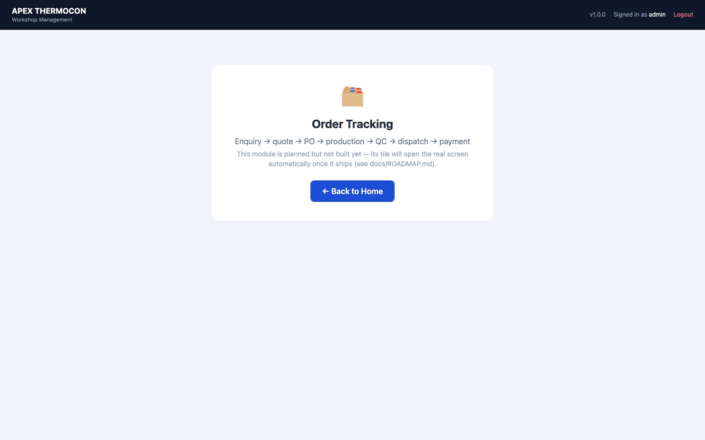

# APEX THERMOCON Workshop — User Guide

A complete guide to using the software, with pictures. Written for the people
who use it every day — no technical knowledge needed. (Screens show sample
data.)

---

## 1. Getting started

### Opening the app
Double-click **APEX Payroll (Admin).exe** on the main computer, or
**APEX Payroll (Operator).exe** on the attendance laptop. A normal app window
opens — no internet needed.

### Signing in

Type your username and password and press **Sign in**. The app comes with two
accounts:

| Account | Password | Who it's for |
|---|---|---|
| `admin` | `admin123` | The owner — full access to everything |
| `operator` | `operator123` | Attendance entry only |

> ⚠️ **Change these passwords** after first use (section 2). The operator
> laptop signs itself in automatically — it goes straight to attendance.

### Home — your modules

After signing in you land on **Home**. Every box (tile) is one part of the
business. Click a tile to open it; the **⌂ All modules** link inside any module
brings you back. Tiles marked **PLANNED** are coming soon — clicking them shows
what they will do:

You only see the tiles your account is allowed to use. Here is what a staff
account with two permissions sees:

---

## 2. Accounts — who can open what

*Owner (admin) only.* Open **Users & Access** from Home.

- **+ Add account** — choose a username and password, then either tick
  **Administrator** (full access, like you) or tick just the modules this
  person may open:

- **Edit** — change what an account can open, or set a new password if someone
  forgot theirs.
- **✕** — delete an account. The app refuses to delete the last administrator
  or the account you're signed in with, so you can't lock yourself out.

---

## 3. Salary & Attendance

The monthly rhythm: **operator fills attendance → it syncs to your machine →
you calculate and publish salaries → print the two Excel sheets.**

### 3.1 The dashboard

Quick counts, plus the sections on the left: Pay Setup, Attendance, Advances,
Calculate Salary, View Salaries, Export Slips, Sync/Exchange, Rules.

### 3.2 Pay Setup

The money side of each employee lives here: **base salary, PF/ESI
applicability, and the advance balance** — press *Edit pay* on a row. Click a
name for the full pay story (salary, attendance and advances over time):

> Everything else about a person — adding employees, profiles, documents,
> the leave bank — lives in **Employee Management** (section 4).

### 3.3 Attendance (usually the operator's job)

**All employees** view: one row per employee, one column per day. Everyone
starts as Present (green) — just click days to mark absences (red) and type
overtime hours where earned. Sundays are highlighted; they're paid days off.
**Save all** stores the whole month in one go.

For one person at a time, use the **Single employee** calendar view:

The reminder banner nags until the previous month is complete (due by the 7th).

### 3.4 Getting attendance to your machine (sync)

Both laptops watch a shared folder (Google Drive / Dropbox):
- The **operator** presses *Export attendance* when the month is done.
- On your next sign-in, the app **offers the file with one Yes/No prompt** —
  accept and it's imported (leave banks and penalties recompute automatically).
- When you change the employee list, press *Export roster*; the operator's app
  picks it up silently.

No shared folder configured? The same buttons download/upload files you can
move by pen drive.

### 3.5 Advances

Pick the employee, enter the amount and how it was paid (cheque + cash must add
up), and the ledger updates. Outstanding advances appear automatically in the
salary table and can be recovered at payroll time.

### 3.6 Calculating and publishing salaries

1. Pick the month and press **Prepare** — one row per employee, pre-filled from
   attendance. A ⚠ badge means a penalty rule fired (hover to see which days).
2. Every attendance number is **yours to adjust**: paid days, penalty days,
   OT hours, refreshment days.
3. Use **Set PF for all eligible…** / **Set ESI for all eligible…**, then
   fine-tune individuals. Enter advance recovery (*Adj Adv*) or fresh advances.
4. **Calculate** shows every total. Cash = Total − Cheque automatically.
5. **Publish** locks the month in: salaries recorded, advance ledgers posted,
   your adjustments written back. Re-publishing the same month overwrites it.

### 3.7 History and Excel sheets

**View Salaries** lists any published month. **Export Slips** downloads the two
sheets the office already uses — the CEO reconciliation sheet and the
distribution slip:

### 3.8 Salary rules

Leave entitlement, overtime rate, penalty tiers, the CNC bonus — all live here
and can be changed without touching the program. Careful: this is the raw
policy file; a friendlier Settings screen is planned.

---

## 4. Employee Management

Everything about your people that isn't money: profiles, documents, the leave
bank, and attendance summaries. Open the **👥 Employee Management** tile.

### 4.1 The roster

Search by name/department/number, filter by department or **Working / Left**.
Each row shows the shift, joining date, leave scheme and the leave bank.
Click a row to open the full record. **+ Add employee** creates a new person —
profile details plus a one-time *Starting pay* box (afterwards pay is managed
in Salary → Pay Setup).

### 4.2 One employee's record

- **Leave bank** — the **+ / −** buttons add or subtract days (for example a
  compensatory day off, or a correction). The bank can never go below zero.
  Overtime-eligible workers have no bank — their absences follow the penalty
  rules at payroll time.
- **Documents** — upload Aadhaar cards, agreements, certificates (label them,
  then *+ Add files*). Photos from a phone are compressed automatically; click
  a name to view, ⬇ to download. Documents ride along in every backup.
- **Pay** — shown read-only here; change it in Salary → Pay Setup.
- **Attendance** — this financial year's totals and the last six months.
- **Deactivate** marks someone as left; history is always kept and they can be
  reactivated any time.

### 4.3 Editing a profile

Name, department, shift, joining date, and the overtime-eligible flag (this
switches the leave scheme, so change it knowingly).

---

## 5. Raw Material Inventory

Every incoming batch of rods/bars is one **heat** — the number stamped on the
mill test certificate. The app tracks each heat from arrival to the orders it
fed.

### 5.1 The stock list

Top strip: total heats, rods in stock, stock value (₹), rods issued. Each row
shows **remaining/received** with a bar and a status: **In stock**,
**Consumed**, or **Rejected** (returned to supplier). Search by heat number,
grade, supplier or rack; filter by material, shape, status — or find steel by
its chemistry (e.g. Carbon 0.40–0.50%).

### 5.2 Adding a heat

Copy the details straight off the mill certificate: heat number, supplier,
material/grade/shape (every dropdown has **+ Add new…** if a value is missing),
size, rods received, weight, price, and the chemistry rows from the
spectroscopy report. After saving, open the heat and attach photos or PDFs of
the certificate and purchase invoice — phone photos are compressed
automatically.

### 5.3 Using stock — the usage log

Open any heat to see its full story. To take rods out:
- **Issued to order** — enter the order/PO number (required) and how many rods.
- **Rejected → supplier** — for bad material; the red **Reject remaining
  batch** button returns everything left in one click.

The app refuses to issue more rods than remain. Deleting a log entry (✕) puts
the rods back — that's also how you undo a rejection.

### 5.4 Tracing an order

The **Usage Log** tab searches every movement by order number — type a PO
number and see exactly which heats (and therefore which mill certificates) fed
that order. That's your traceability answer when a customer asks.

### 5.5 Lists

Material classes, shapes, grades and chemical elements are yours to manage.
Removing a value never changes heats already recorded with it.

---

## 6. Keeping your data safe

- **Back up regularly:** Salary & Attendance → Sync/Exchange → **Back up now**.
  Each backup is one `.zip` holding the entire database *and* every
  attachment (inventory certificates and employee documents). *Download a copy* saves it wherever you choose — keep one off the
  computer.
- **Restore:** unzip into the app's data folder (`%APPDATA%\APEX Payroll\`),
  replacing `salary.db`, `inventory_files/` and `employee_files/`.
- **Updates:** when a new version is released, a popup offers it at sign-in —
  one click downloads, restarts, done. Your data is never touched. No popup =
  you're up to date (the `v1.x.x` label in the header checks on demand).

---

## 7. If something goes wrong

| Problem | What to do |
|---|---|
| Forgot a password | An administrator resets it in **Users & Access → Edit**. |
| "Only N rods remaining" | You tried to issue more than the heat has left — check the heat's usage log. |
| "Cheque + Cash must equal…" | The two amounts must add up to the total/advance exactly. |
| Attendance won't import | Only the **admin** machine imports attendance; only the **operator** machine imports the roster. Check you're on the right laptop. |
| A tile is missing | That account wasn't given access — the owner can grant it in **Users & Access**. |
| App window never opens | Rare: install Microsoft's WebView2 runtime (see DEPLOY.md), or the app opens in your browser instead. |

*Developer-facing documentation starts at [START_HERE.md](START_HERE.md).*
