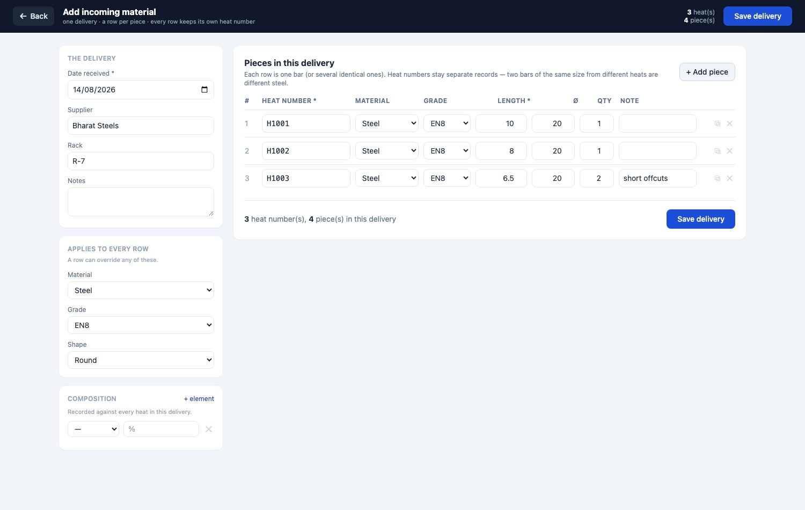
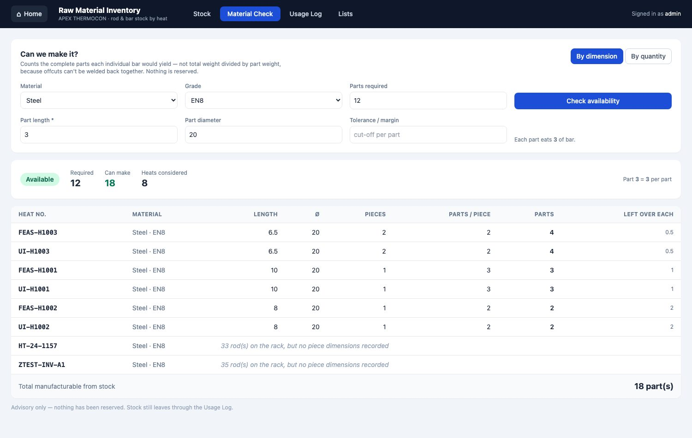
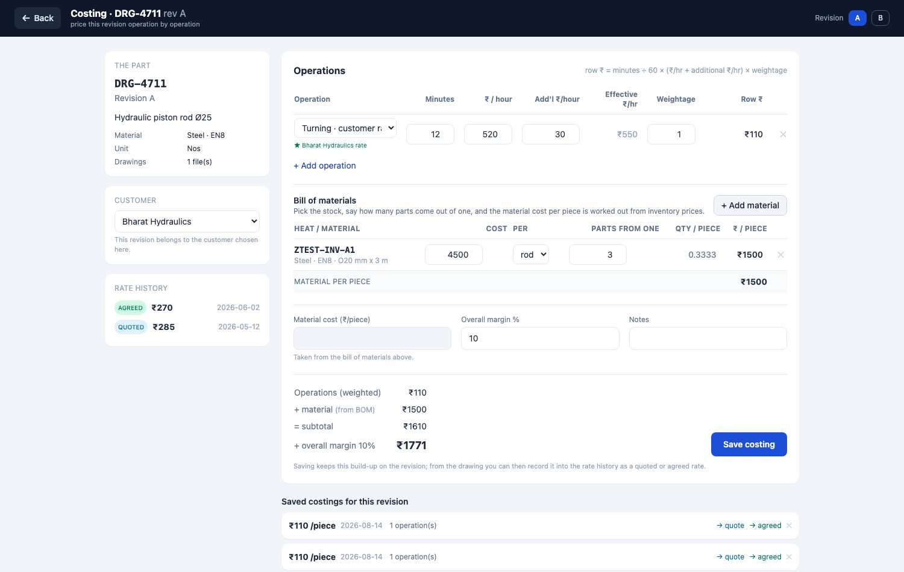
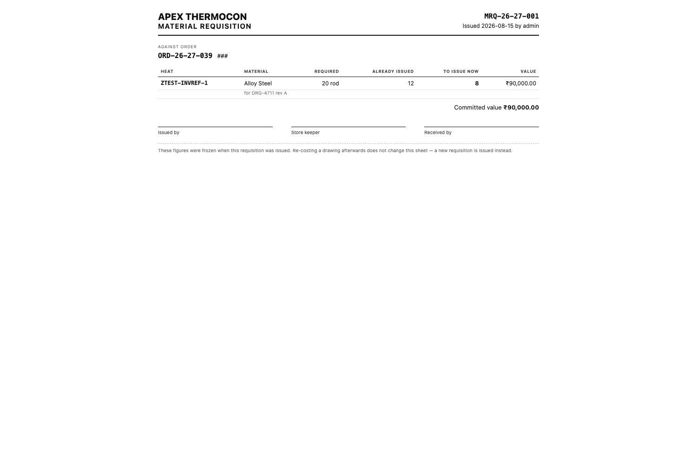
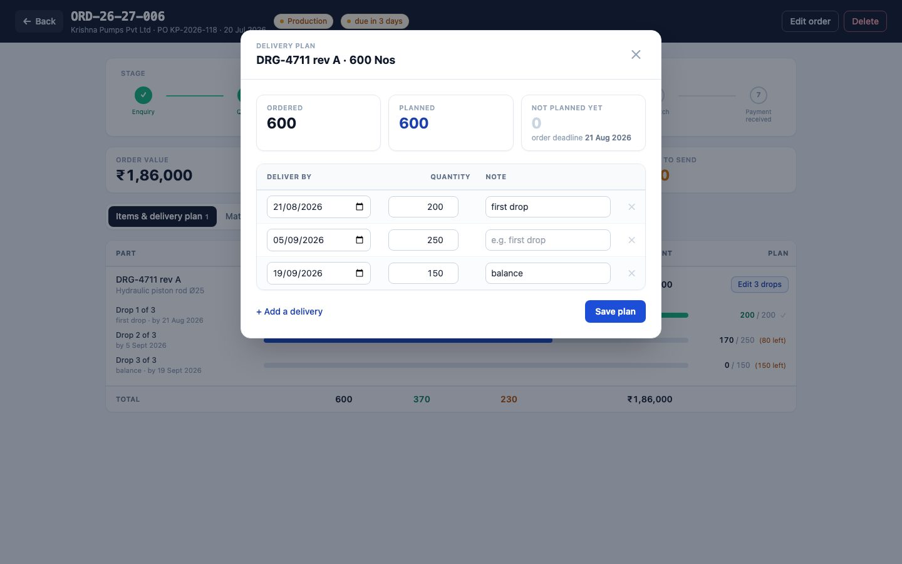
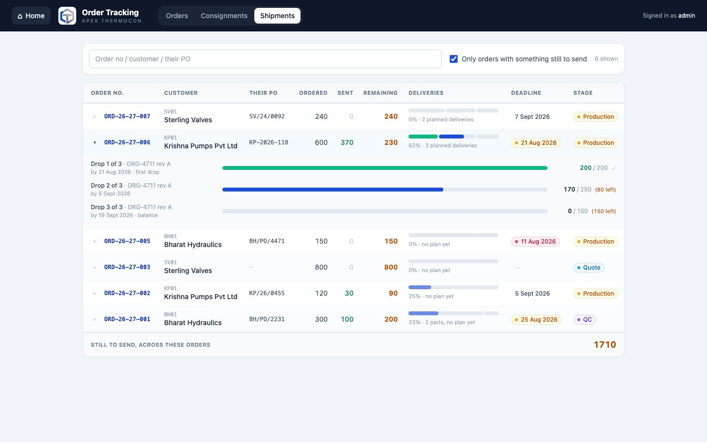
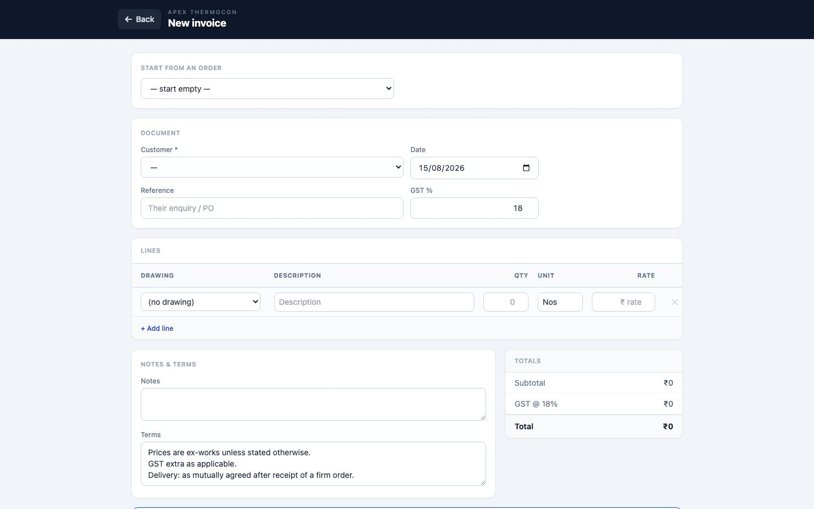

# APEX THERMOCON Workshop — User Guide

A complete guide to using the software, with pictures. Written for the people
who use it every day — no technical knowledge needed. (Screens show sample
data.)

**You can read this inside the app**: sign in and click the **📖 User Guide**
tile on Home, or go straight to `/help/`. It has a contents list down the side
and a search box, and it works with no internet.

The guide is **only available to the owner's account**. If you use the software
day to day and need to know how something works, ask them — they can look it up
for you.

---

## 1. Getting started
<!-- access: general -->

### Opening the app
Double-click **APEX Payroll (Admin).exe** on the main computer, or
**APEX Payroll (Operator).exe** on the attendance laptop. A normal app window
opens — no internet needed.

### Signing in

Type your username and password and press **Sign in**. The app comes with two
accounts:

| Account | Password | Who it's for |
|---|---|---|
| `admin` | `admin123` | The owner — full access to everything |
| `operator` | `operator123` | Attendance entry only |

> ⚠️ **Change these passwords** after first use (section 2). The operator
> laptop signs itself in automatically — it goes straight to attendance.

### Home — your modules

After signing in you land on **Home**. Every box (tile) is one part of the
business — all of them are live. Click a tile to open it; the **⌂ Home**
button at the top-left of any module brings you back.

You only see the tiles your account is allowed to use. Here is what a staff
account with two permissions sees:

### Deadlines coming up

Under the tiles you'll find a panel of orders whose delivery dates are close,
split into **Next 7 days** and **Next month**, with anything already **overdue**
called out in red above them. Each line names the customer, the order number and
how much of it still has to go out.

An order disappears from the panel once it has been fully sent — nothing left to
deliver is not a deadline. If you have nothing due, the panel doesn't appear at
all. It's only visible to accounts that can open Order Tracking.

---

## 2. Accounts — who can open what
<!-- access: admin -->

*Owner (admin) only.* Open **Users & Access** from Home.

- **+ Add account** — choose a username and password, then either tick
  **Administrator** (full access, like you) or tick just the modules this
  person may open:

- **Edit** — change what an account can open, or set a new password if someone
  forgot theirs.
- **✕** — delete an account. The app refuses to delete the last administrator
  or the account you're signed in with, so you can't lock yourself out.

---

## 3. Salary & Attendance
<!-- access: salary -->

The monthly rhythm: **operator fills attendance → it syncs to your machine →
you calculate and publish salaries → print the two Excel sheets.**

### 3.1 The dashboard

Quick counts, plus the sections on the left: Pay Setup, Attendance, Advances,
Calculate Salary, View Salaries, Export Slips, Sync/Exchange, Rules.

### 3.2 Pay Setup

The money side of each employee lives here: **base salary, PF/ESI
applicability, and the advance balance** — press *Edit pay* on a row. Click a
name for the full pay story (salary, attendance and advances over time):

> Everything else about a person — adding employees, profiles, documents,
> the leave bank — lives in **Employee Management** (section 4).

### 3.3 Attendance (usually the operator's job)

**All employees** view: one row per employee, one column per day. Everyone
starts as Present (green) — just click days to mark absences (red) and type
overtime hours where earned. Sundays are highlighted; they're paid days off.
**Save all** stores the whole month in one go.

For one person at a time, use the **Single employee** calendar view:

The reminder banner nags until the previous month is complete (due by the 7th).

### 3.4 Getting attendance to your machine (sync)

Both laptops watch a shared folder (Google Drive / Dropbox):
- The **operator** presses *Export attendance* when the month is done.
- On your next sign-in, the app **offers the file with one Yes/No prompt** —
  accept and it's imported (leave banks and penalties recompute automatically).
- When you change the employee list, press *Export roster*; the operator's app
  picks it up silently.

No shared folder configured? The same buttons download/upload files you can
move by pen drive.

### 3.5 Advances

Pick the employee, enter the amount and how it was paid (cheque + cash must add
up), and the ledger updates. Outstanding advances appear automatically in the
salary table and can be recovered at payroll time.

### 3.6 Calculating and publishing salaries

1. Pick the month and press **Prepare** — one row per employee, pre-filled from
   attendance. A ⚠ badge means a penalty rule fired (hover to see which days).
2. Every attendance number is **yours to adjust**: paid days, penalty days,
   OT hours, refreshment days.
3. Use **Set PF for all eligible…** / **Set ESI for all eligible…**, then
   fine-tune individuals. Enter advance recovery (*Adj Adv*) or fresh advances.
4. **Calculate** shows every total. Cash = Total − Cheque automatically.
5. **Publish** locks the month in: salaries recorded, advance ledgers posted,
   your adjustments written back. Re-publishing the same month overwrites it.

### 3.7 History and Excel sheets

**View Salaries** lists any published month. **Export Slips** downloads the two
sheets the office already uses — the CEO reconciliation sheet and the
distribution slip:

### 3.8 Salary rules

Leave entitlement, overtime rate, penalty tiers, the CNC bonus — all live here
and can be changed without touching the program. Careful: this is the raw
policy file; a friendlier Settings screen is planned.

---

## 4. Employee Management
<!-- access: employees -->

Everything about your people that isn't money: profiles, documents, the leave
bank, and attendance summaries. Open the **👥 Employee Management** tile.

### 4.1 The roster

Search by name/department/number, filter by department or **Working / Left**.
Each row shows the shift, joining date, leave scheme and the leave bank.
Click a row to open the full record. **+ Add employee** creates a new person —
profile details plus a one-time *Starting pay* box (afterwards pay is managed
in Salary → Pay Setup).

### 4.2 One employee's record

- **Leave bank** — the **+ / −** buttons add or subtract days (for example a
  compensatory day off, or a correction). The bank can never go below zero.
  Overtime-eligible workers have no bank — their absences follow the penalty
  rules at payroll time.
- **Documents** — upload Aadhaar cards, agreements, certificates (label them,
  then *+ Add files*). Photos from a phone are compressed automatically; click
  a name to view, ⬇ to download. Documents ride along in every backup.
- **Pay** — shown read-only here; change it in Salary → Pay Setup.
- **Attendance** — this financial year's totals and the last six months.
- **Deactivate** marks someone as left; history is always kept and they can be
  reactivated any time.

### 4.3 Editing a profile

Name, department, shift, joining date, and the overtime-eligible flag (this
switches the leave scheme, so change it knowingly).

---

## 5. Raw Material Inventory
<!-- access: inventory -->

Every incoming batch of rods/bars is one **heat** — the number stamped on the
mill test certificate. The app tracks each heat from arrival to the orders it
fed.

### 5.1 The stock list

Top strip: total heats, rods in stock, stock value (₹), rods issued. Each row
shows **remaining/received** with a bar and a status: **In stock**,
**Consumed**, or **Rejected** (returned to supplier). Search by heat number,
grade, supplier or rack; filter by material, shape, status — or find steel by
its chemistry (e.g. Carbon 0.40–0.50%).

### 5.2 Adding incoming material

**+ New heat** opens a **whole screen**, not a small popup — a delivery is
usually a dozen bars across several heat numbers, and that needs room.

On the left, the things true of the whole delivery: date received, supplier,
rack, and the material/grade/shape most of it is. On the right, **one card per
piece**. Press **+ Add piece** for each one, or the ⧉ button to duplicate the
card above when only the heat number changes.

**Supplier** is a dropdown, not a typing box. Pick an existing mill, or choose
**+ Add new…** to enter one — it joins the list from then on, so the same
supplier never ends up spelled three different ways. You can tidy the list in
the **Lists** tab.

**Chemistry per piece.** Press **+ Chemistry** on any card to record that heat's
spectroscopy analysis — element and percentage, as many rows as the report has.
This sits on the piece, not the delivery, because the composition is the whole
reason heat numbers are kept apart. If several cards share one heat number they
share one analysis. The small Composition box on the left is only a fallback for
cards you leave blank.

Each row carries its **own heat number**, and that matters more than anything
else on this screen. Two bars can be the same steel, the same diameter, from the
same lorry, and still be *different metal* — a different heat is a different
melt with a different composition. So the software never merges them: each heat
number becomes its own record and stays that way for good.

| Column | What to put in it |
| --- | --- |
| **Heat number** | Off the mill certificate. Required. |
| **Material / Grade** | Leave blank to inherit what you set on the left. |
| **Length** | The actual length of this bar. Required — it is what makes the material check possible. |
| **Ø** | Diameter. |
| **Qty** | How many identical bars of this length. |
| **Note** | Anything worth remembering, e.g. "short offcuts". |

The header keeps a running tally — *3 heat number(s), 4 piece(s)* — so you can
check it against the delivery challan before saving. **Save delivery** records
the whole thing at once: if one heat number turns out to be a duplicate,
nothing at all is saved and you can fix that row.

Afterwards, open any heat to attach photos or PDFs of the mill certificate and
purchase invoice — phone photos are compressed automatically. Editing an
existing heat still opens the familiar popup, where you can also correct the
piece lengths and diameters.

> If you don't know the lengths, you can still record the heat the old way and
> leave the pieces out. You just won't be able to check it by dimension —
> only by counting bars.

### 5.3 Can we actually make it? — the Material Check

The **Material Check** tab answers the question you ask before promising a
customer anything: *do we have enough steel to make this?*

Fill in the material, the grade, how many parts you need, and the part's length
and diameter. Add a **tolerance / margin** if each part needs a little extra for
parting off and facing. Press **Check availability**.

**How the number is worked out** — this is the important bit. The software
counts the whole parts that come out of *each individual bar*, then adds those
up. It does **not** divide total stock by part size, because offcuts can't be
welded back together.

> Three bars, each 10 long, and you need parts 3 long:
> each bar gives `10 ÷ 3 = 3` whole parts with 1 left over as scrap.
> **3 bars × 3 = 9 parts.** Not 10.

The result is broken down **heat by heat**, so you can see exactly which bars
the job would come off:

| Heat | Length | Pieces | Parts / piece | Parts |
| --- | ---: | ---: | ---: | ---: |
| H1001 | 10 | 1 | 3 | 3 |
| H1002 | 8 | 1 | 2 | 2 |
| H1003 | 6.5 | 2 | 2 | 4 |
| | | | **Total** | **9** |

You also get a status — **Available**, **Partially available** or **Not
available** — with the shortfall if you're short, the leftover on each bar, and
an honest note against any heat whose dimensions were never recorded ("33 rods
on the rack, but no piece dimensions recorded") so nothing quietly disappears
from the answer.

Switch to **By quantity** when the dimensions don't decide it and you just want
to know how many bars are on the rack.

Nothing is reserved. The check only tells you what's possible right now; stock
still leaves the rack through the usage log.

### 5.4 Using stock — the usage log

Open any heat to see its full story. To take rods out:
- **Issued to order** — enter the order/PO number (required) and how many rods.
- **Rejected → supplier** — for bad material; the red **Reject remaining
  batch** button returns everything left in one click.

The app refuses to issue more rods than remain. Deleting a log entry (✕) puts
the rods back — that's also how you undo a rejection.

### 5.5 Tracing an order

The **Usage Log** tab searches every movement by order number — type a PO
number and see exactly which heats (and therefore which mill certificates) fed
that order. That's your traceability answer when a customer asks.

### 5.6 Lists

Material classes, shapes, grades and chemical elements are yours to manage.
Removing a value never changes heats already recorded with it.

---

## 6. Customers
<!-- access: customers -->

Open the **🏢 Customers** tile. One record per customer: GSTIN, billing and
shipping addresses, payment terms, and the people you talk to.

**+ Add customer** creates one; click a row and the customer's record opens as
a **full window** — a Back button top-left takes you to the list. It needs the
room: the record holds their profile, a growth chart, every order and every
document. Editing still opens a small form on top. You add contact persons
(name, role, phone, email) there. Customers with orders or drawings
can be **deactivated** but never deleted — history stays intact.

Every customer gets a short **code** automatically: the initials of the name
plus a number, so Acme Castings becomes **AC01** and the next AC… customer
becomes **AC02**. "M/s", "Pvt", "Ltd" and similar words are ignored. If you'd
rather the initials were something else, type them in the form — the code
preview updates as you type. You can search the list by code, name or GSTIN.

The record has three tabs.

### 6.1 Business — what they're worth to you

Lifetime total, number of orders, average order value and how much is still
open, then a **month-by-month bar chart** of business won — hover a bar to see
the running total to that month. Below it, every order newest-first with its
stage, and every quotation and invoice with a **Print** button, so any past
document can be reprinted from here without hunting for the original.

### 6.2 Rates — the prices you agreed with them

Most customers negotiate their own machining rates. Put them here once and every
part you price for that customer uses them automatically.

Pick the **Operation**, type **Their ₹/hour** (what this customer pays for it),
optionally an **Additional ₹/hour** on top, add a note like *"agreed Apr 2026"*
so you remember when it was settled, and press **Save**. The standard shop rate
from Settings sits greyed out in the **Standard ₹/hr** column beside it, so you
can see at a glance what was negotiated.

- The **effective rate** is *their ₹/hour + additional ₹/hour*. In the picture,
  ₹520 + ₹30 = **₹550/hour**.
- Saving the same operation again updates it — you never get duplicate rows.
- Changing a rate here reprices every future costing for that customer in one
  edit. Costings you already saved keep the price they were saved with.

---

## 7. Parts & Pricing
<!-- access: parts -->

Open the **📐 Parts & Pricing** tile — one record per customer drawing.

- **Drawing number + revision** identify the part; **+ Revision** starts a new
  revision (its rates and files begin fresh — pricing history is per revision).
- **Drawing files** — attach the PDF or a scan.
- **Rate history** answers "what did we charge last time": dated entries marked
  **quoted / agreed / revised**, newest first. The latest rate shows on the
  list and auto-fills order items.
- **Customer** — assign the drawing to a customer here. This is what makes the
  costing screen use that customer's agreed rates.

### 7.1 The costing workspace

**Open costing workspace** on a drawing gives pricing a full screen of its own.

The part, its customer and its rate history sit on the left; the operations
table is on the right. Switch revisions with the **A / B** buttons at the top
right — each revision is priced separately.

Add a row per operation with **+ Add operation**, then fill in:

| Column | What to put in it |
| --- | --- |
| **Operation** | Pick from your Settings list. The rates fill in by themselves. |
| **Minutes** | Minutes this operation takes **per piece**. |
| **₹ / hour** | The hourly rate. Comes from Settings, or from the customer's agreed rate if they have one. |
| **Add'l ₹/hour** | Extra rupees per hour for this one operation — a better machine, a tighter tolerance, an awkward setup. |
| **Effective ₹/hr** | Calculated: ₹/hour + additional ₹/hour. Not editable. |
| **Weightage** | How much this operation counts relative to its clock time. Leave blank for normal (1). |
| **Row ₹** | Calculated: `minutes ÷ 60 × effective ₹/hr × weightage`. |

Everything recalculates as you type — there is no "calculate" button.

> **The additional margin is rupees per hour, not a percentage.** ₹520/hour with
> ₹30 additional means you are charging **₹550 an hour**, so 12 minutes costs
> ₹110. It sits in the same units as the rate next to it, so the two numbers are
> directly comparable.

**Weightage** is for work that is worth more than the stopwatch says. Setup time
spread across a batch, a second spindle running at the same time, an allowance
for scrap — put 1.5 and the row bills at one and a half times.

When the drawing belongs to a customer who has agreed rates, the row shows a
green **★ *customer* rate** badge and uses their price instead of the shop
standard. No badge means it's the standard Settings rate.

Below the table, add **material cost per piece** and an **overall margin %**;
the build-up on the right shows operations → + material → + margin → the final
₹/piece. **Save costing** stores it against the revision, and from the drawing
you can then push it into the rate history with **→ quote** or **→ agreed**.

A saved costing keeps the rates it was saved with. Changing a rate in Settings
or on the customer later will never quietly change a price you already quoted.

### 7.2 Bill of materials — pricing the steel from stock

You no longer have to remember what the bar cost. **+ Add material** in the
costing workspace searches your inventory:

Type a **heat number**, a **grade** (EN8), a **material** (Stainless Steel) or a
**supplier** — one box searches all of them. Each result shows what's left on the
rack and what that steel cost per rod (or per kg), worked out from the purchase
price you recorded when it came in.

Pick one and it becomes a line in the bill of materials. Then fill in the one
number only you know: **how many parts come out of one rod**. The cost per piece
follows:

> A rod cost ₹4,500 and yields 3 parts → **₹1,500 of material in every piece.**

Add as many lines as the part needs. The **Material per piece** total feeds
straight into the costing, and while a bill of materials exists the manual
"Material cost" box is greyed out — one number, one source, so the two can never
disagree.

Like the operation rates, the prices are **frozen into the costing when you
save**. If that steel costs more next month, the quote you already sent doesn't
change underneath you.

---

## 8. Order Tracking
<!-- access: orders -->

Open the **🗂 Order Tracking** tile. It has three tabs: **Orders**,
**Consignments** and **Shipments**.

Clicking an order opens it as a **full window** with a Back button — an order
carries its items, its delivery plan, its shipments and its stage history, which
is more than a popup can hold. **New order** and **Edit** both fill the screen
the same way.

- **New order** — pick the customer, note their PO number, add items (picking
  a drawing fills the unit and its latest rate). The order number is automatic
  (format set in Settings) and restarts every financial year.
- **Deadline** — the date the whole order must be with the customer. It shows as
  a column on the list, turning **amber inside a week** and **red once overdue**,
  and it drives the warning panel on Home.
- **Stages** — Enquiry → Quote → PO received → Production → QC → Dispatch →
  Payment received. Click any stage to move there (skipping is fine); every
  move is logged with a note.
- **Material used** — rods issued in Inventory against this order number
  appear automatically, with their heat numbers: order → heat → mill
  certificate, the full traceability chain.
- **Shipping (consignments)** — press **🚚 Ship**:

  Enter the GST paperwork (transporter, LR number, e-way bill, invoice,
  vehicle, freight) and the quantities going on this truck. **Partial
  shipments are fine**, and one consignment can carry items from **several
  orders** (type another order number and press *Add order*). The app refuses
  to ship more than an item has left. The **Consignments** tab lists every
  shipment — mark them **Delivered ✓** when confirmed.

### 8.1 What material this order needs

Under the items you'll find **Bill of materials — what this order commits**.

The order doesn't have its own material list; its *parts* do. So the app takes
each item, looks up that drawing's latest costing, and multiplies the material
per piece by how many you've ordered — then adds it up by heat number, because
the heat is what actually has to come off the rack.

> 60 shafts, and the costing says one rod makes 3 → **20 rods of H1001, ₹90,000.**

Next to each line you'll see what has already been **issued** against this order
number in Inventory, and what is **still to issue**. So one table answers both
"what does this job need?" and "how much of it have we taken out?".

A line in grey under the table means an item couldn't contribute — it has no
drawing, its drawing has no costing yet, or that costing has its material cost
typed in by hand instead of picked from stock. It says which, so you know what to
fix rather than wondering why a number looks low. If a heat was issued to this
order that no part on it calls for, that's flagged in amber.

#### Issuing it to the store

**📄 Issue requisition** turns that list into a real document — its own number
(MRQ-26-27-001, restarting each financial year), and it opens ready to print.

It shows each heat with **Required**, **Already issued** and **To issue now**,
the committed value, and lines to sign: issued by, store keeper, received by.
Print it or Save as PDF — no internet, nothing to install.

> The figures are **frozen** the moment you issue it. If someone re-costs the
> drawing tomorrow, this sheet does not change — you issue a new one. That is
> deliberate: paper already on the shop floor must mean what it said when it
> was handed over.

Every requisition you've issued for an order is listed underneath it, so you can
reprint any of them later.

### 8.2 Planning a long order

Some orders run for months and go out in instalments. Press **Plan** on any item
to say when each part of it is due:

> An order for 600 pieces: 250 by 15 September, 100 by 15 October, and the
> remaining 250 before the deadline.

Add a line per drop. The **+ Remaining (N) by the deadline** button writes that
last line for you, using the order's own deadline. The panel keeps three figures
in view — **Ordered**, **Planned** and **Not planned yet** — and the last one is
worked out for you, so it can never disagree with the others. You can't plan more
than the item quantity; the app will say so.

The button on the item row then shows how many drops are planned, so you can see
at a glance which items have a schedule and which don't.

### 8.3 Sending it out, drop by drop

The **Shipments & history** tab shows the order broken into the deliveries you
planned, each with its own progress bar and its own **🚚 Ship this** button.

Press it and the consignment form opens with that part already chosen and that
drop's outstanding quantity filled in — you only have to add the lorry details.

> **Sending more than planned is fine.** If a drop was for 250 and you send 300,
> that drop closes and the extra 50 counts towards the next one, which now needs
> 100 instead of 150. You never have to go back and rewrite the plan.

A completed drop turns green and loses its button. If you send more than the
whole plan accounts for, a note tells you so. **Ship something else** is there
for a mixed lorry carrying several orders, or a part with no plan at all.

### 8.4 Shipments — what do we still owe?

The **Shipments** tab is the answer to *"how much of this order is still to go?"*

One row per order: how much was **ordered**, how much has been **sent**, how much
**remains**, and a progress bar. "Sent" counts every consignment ever raised
against that order, so an order delivered in six lorries over four months adds up
correctly. By default you only see orders that still owe something — untick the
box to include the finished ones. The figure at the bottom is everything still
outstanding across the orders shown.

---

## 9. Quotations & Invoices
<!-- access: quotations -->

Open the **🧾 Quotations & Invoices** tile. Both live here — a quotation is what
you send before the work, an invoice is what you send after it.

**+ Quotation** or **+ Invoice** opens a full screen (editing an existing one
still opens the popup). Choose the customer and their
details fill in. Add a line per item: description, quantity, rate — the amount,
subtotal, GST and grand total all calculate themselves. For an invoice you can
pick an **order** instead and its items are copied in for you, so you are not
retyping what you already entered in Order Tracking.

Document numbers are issued automatically per financial year, and quotations and
invoices are numbered in separate series.

### 9.1 Checking material before you commit

While writing a quotation you can tick **☐ Check material availability**.

It is entirely optional and off unless you tick it — the quotation is written
and saved exactly as before either way. Ticking it opens the same check
described in [5.3](#53-can-we-actually-make-it--the-material-check), with the
quantity already filled in from your quotation lines. Fill in the part length,
diameter and any margin, press **Check stock**, and you get the same heat-wise
answer right there in the form.

The point is to find out you're short *before* you promise a date, not after.
Nothing is reserved and the check never stops you saving — a shortage is
information, not a blocker. The same checkbox is on the new-order screen.

### 9.2 Printing and sending

**Print** opens a clean A4 copy in a new tab.

From there use your browser's print dialog — choose your printer for a paper
copy, or **Save as PDF** to get a file you can email or put on WhatsApp. There
is nothing extra to install.

Every document stays on the customer's **Business** tab too, so you can reprint
any past quotation or invoice from there at any time.

---

## 10. Settings
<!-- access: settings -->

Open the **⚙ Settings** tile (changes are owner/admin only).

- **Order numbers** — the format template (`{FY}` financial year, `{SEQ}`
  running number) with a live preview of the next number.
- **Units** — the searchable list every unit dropdown uses.
- **Machining operations & hourly rates** — what the Parts costing builder
  charges per hour. Changing a rate affects new costings only.
- **Departments** — shared with employees and payroll.

---

## 11. Keeping your data safe
<!-- access: admin -->

- **Back up regularly:** Salary & Attendance → Sync/Exchange → **Back up now**.
  Each backup is one `.zip` holding the entire database *and* every
  attachment (inventory certificates and employee documents). *Download a copy* saves it wherever you choose — keep one off the
  computer.
- **Restore:** unzip into the app's data folder (`%APPDATA%\APEX Payroll\`),
  replacing `salary.db` and **every** `*_files/` folder in the zip
  (`inventory_files/`, `employee_files/`, `drawing_files/`).
- **Updates:** when a new version is released, a popup offers it at sign-in —
  one click downloads, restarts, done. Your data is never touched. No popup =
  you're up to date (the `v1.x.x` label in the header checks on demand).

---

## 12. If something goes wrong
<!-- access: general -->

| Problem | What to do |
|---|---|
| Forgot a password | An administrator resets it in **Users & Access → Edit**. |
| "Only N rods remaining" | You tried to issue more than the heat has left — check the heat's usage log. |
| "Cheque + Cash must equal…" | The two amounts must add up to the total/advance exactly. |
| Attendance won't import | Only the **admin** machine imports attendance; only the **operator** machine imports the roster. Check you're on the right laptop. |
| A tile is missing | That account wasn't given access — the owner can grant it in **Users & Access**. |
| App window never opens | Rare: install Microsoft's WebView2 runtime (see DEPLOY.md), or the app opens in your browser instead. |

*Developer-facing documentation starts at [START_HERE.md](START_HERE.md).*
