# APEX THERMOCON Workshop — User Guide

A complete guide to using the software, with pictures. Written for the people
who use it every day — no technical knowledge needed. (Screens show sample
data.)

---

## 1. Getting started

### Opening the app
Double-click **APEX Payroll (Admin).exe** on the main computer, or
**APEX Payroll (Operator).exe** on the attendance laptop. A normal app window
opens — no internet needed.

### Signing in

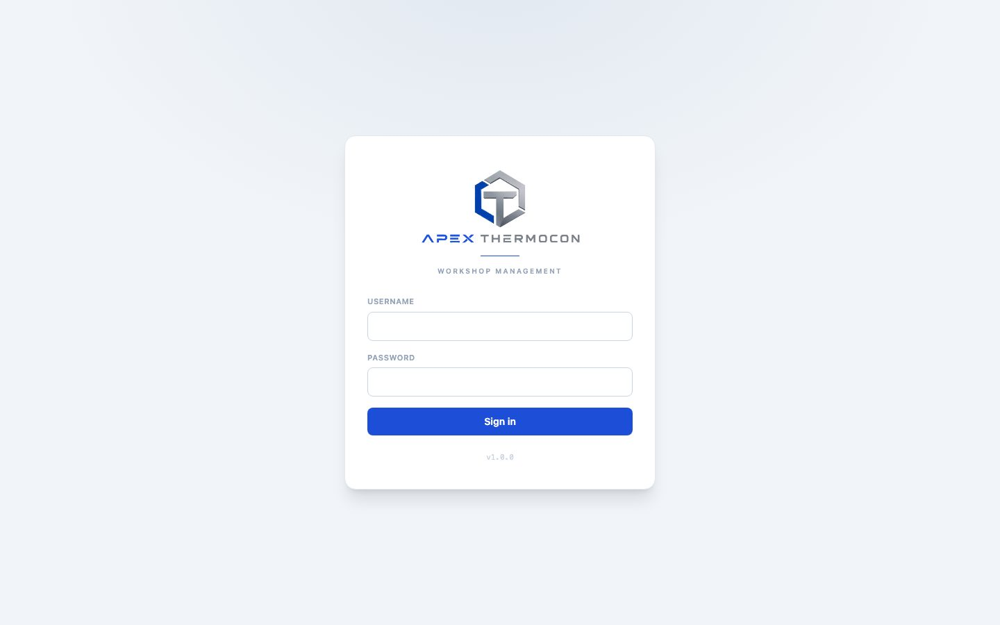

Type your username and password and press **Sign in**. The app comes with two
accounts:

| Account | Password | Who it's for |
|---|---|---|
| `admin` | `admin123` | The owner — full access to everything |
| `operator` | `operator123` | Attendance entry only |

> ⚠️ **Change these passwords** after first use (section 2). The operator
> laptop signs itself in automatically — it goes straight to attendance.

### Home — your modules

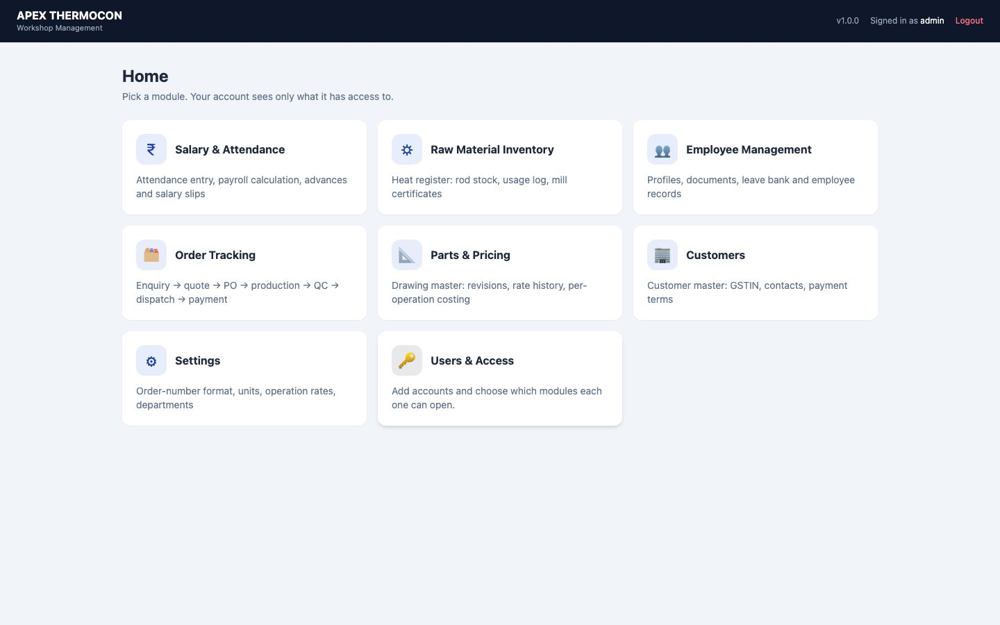

After signing in you land on **Home**. Every box (tile) is one part of the
business — all seven modules are live. Click a tile to open it; the
**⌂ All modules** link inside any module brings you back.

You only see the tiles your account is allowed to use. Here is what a staff
account with two permissions sees:

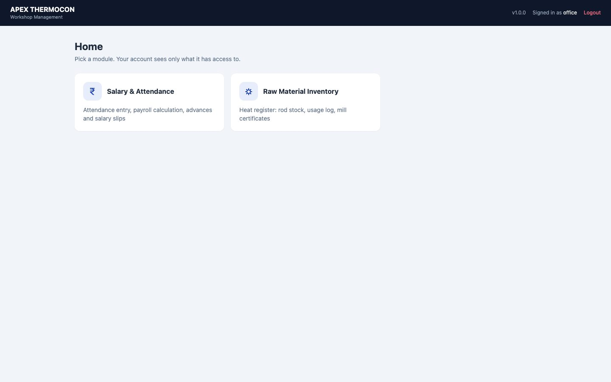

---

## 2. Accounts — who can open what

*Owner (admin) only.* Open **Users & Access** from Home.

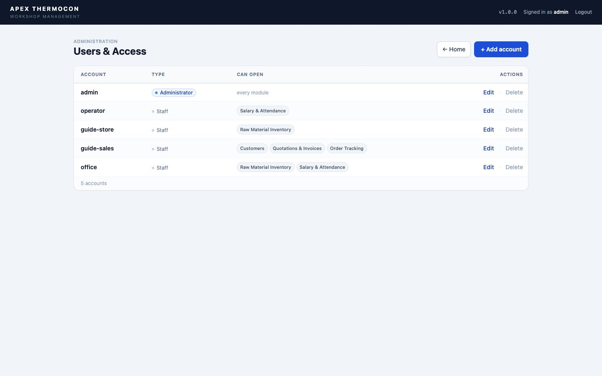

- **+ Add account** — choose a username and password, then either tick
  **Administrator** (full access, like you) or tick just the modules this
  person may open:

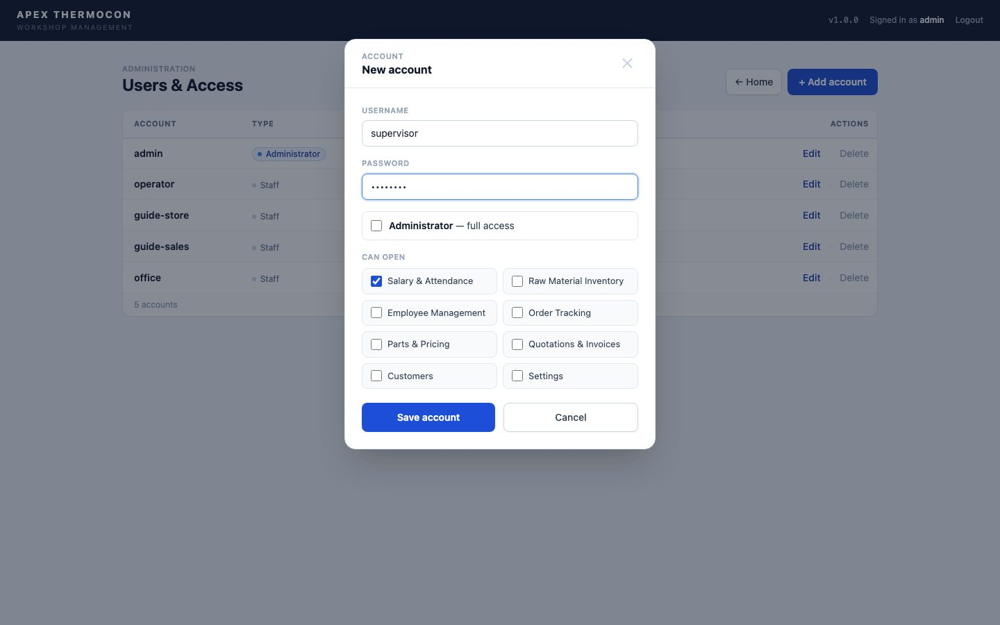

- **Edit** — change what an account can open, or set a new password if someone
  forgot theirs.
- **✕** — delete an account. The app refuses to delete the last administrator
  or the account you're signed in with, so you can't lock yourself out.

---

## 3. Salary & Attendance

The monthly rhythm: **operator fills attendance → it syncs to your machine →
you calculate and publish salaries → print the two Excel sheets.**

### 3.1 The dashboard

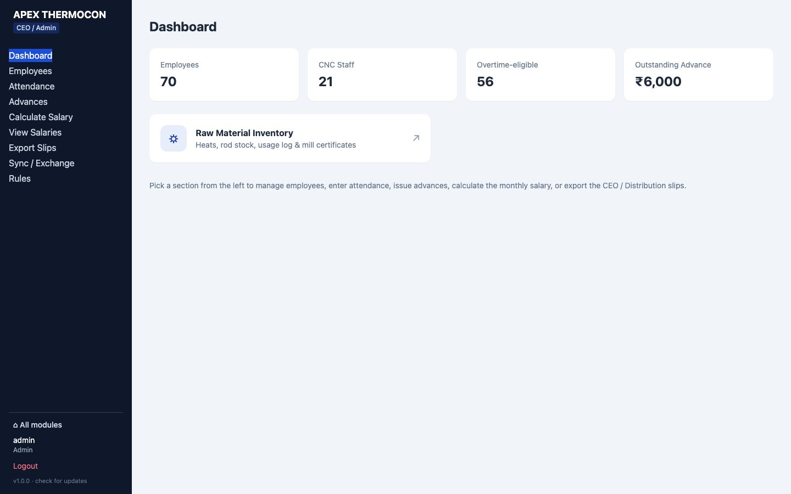

Quick counts, plus the sections on the left: Pay Setup, Attendance, Advances,
Calculate Salary, View Salaries, Export Slips, Sync/Exchange, Rules.

### 3.2 Pay Setup

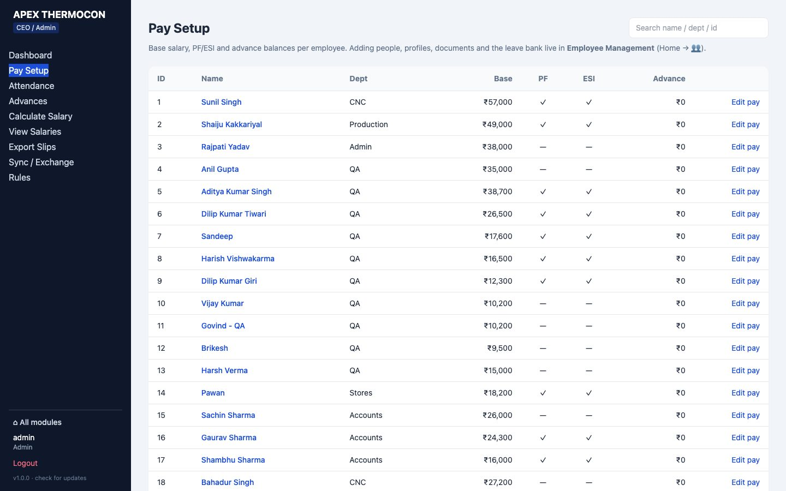

The money side of each employee lives here: **base salary, PF/ESI
applicability, and the advance balance** — press *Edit pay* on a row. Click a
name for the full pay story (salary, attendance and advances over time):

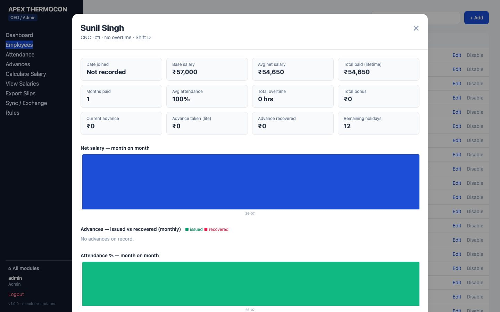

> Everything else about a person — adding employees, profiles, documents,
> the leave bank — lives in **Employee Management** (section 4).

### 3.3 Attendance (usually the operator's job)

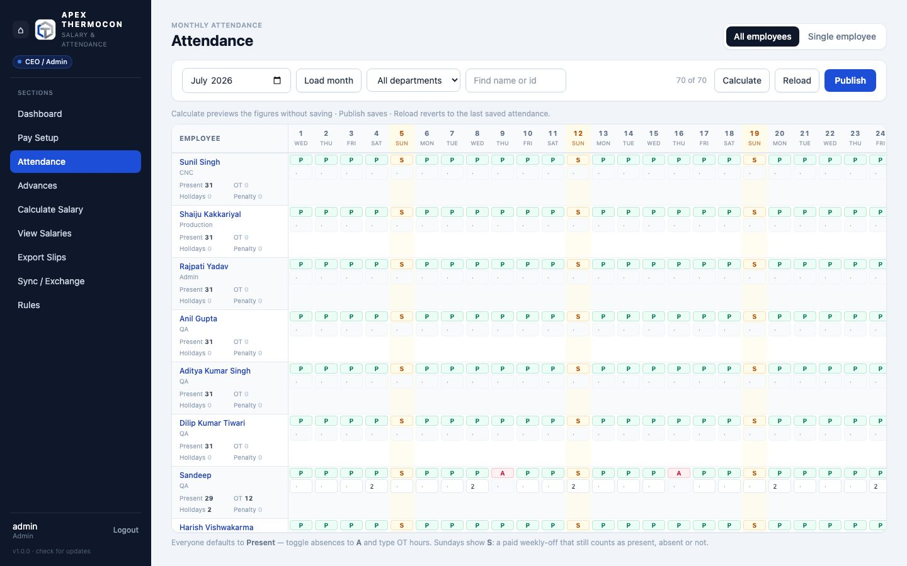

**All employees** view: one row per employee, one column per day. Everyone
starts as Present (green) — just click days to mark absences (red) and type
overtime hours where earned. Sundays are highlighted; they're paid days off.
**Save all** stores the whole month in one go.

For one person at a time, use the **Single employee** calendar view:

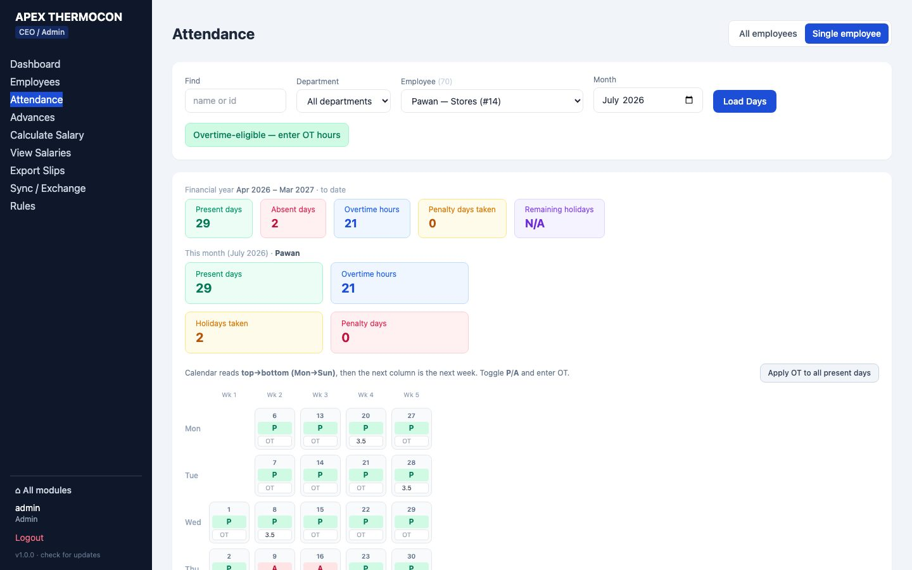

The reminder banner nags until the previous month is complete (due by the 7th).

### 3.4 Getting attendance to your machine (sync)

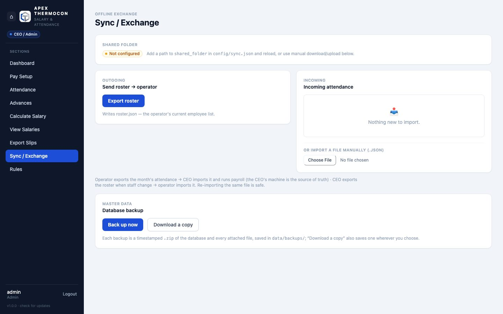

Both laptops watch a shared folder (Google Drive / Dropbox):
- The **operator** presses *Export attendance* when the month is done.
- On your next sign-in, the app **offers the file with one Yes/No prompt** —
  accept and it's imported (leave banks and penalties recompute automatically).
- When you change the employee list, press *Export roster*; the operator's app
  picks it up silently.

No shared folder configured? The same buttons download/upload files you can
move by pen drive.

### 3.5 Advances

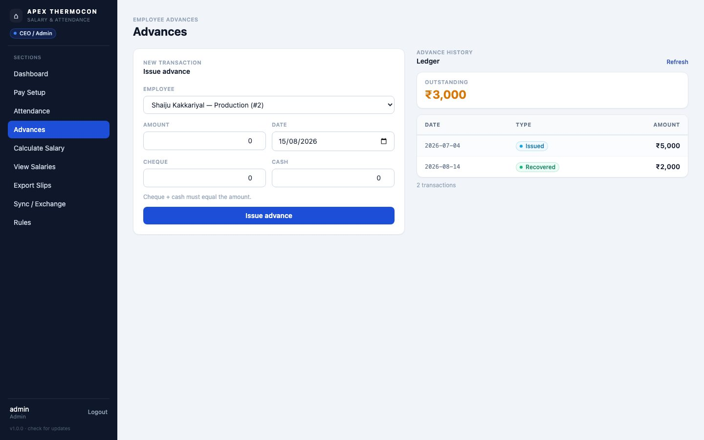

Pick the employee, enter the amount and how it was paid (cheque + cash must add
up), and the ledger updates. Outstanding advances appear automatically in the
salary table and can be recovered at payroll time.

### 3.6 Calculating and publishing salaries

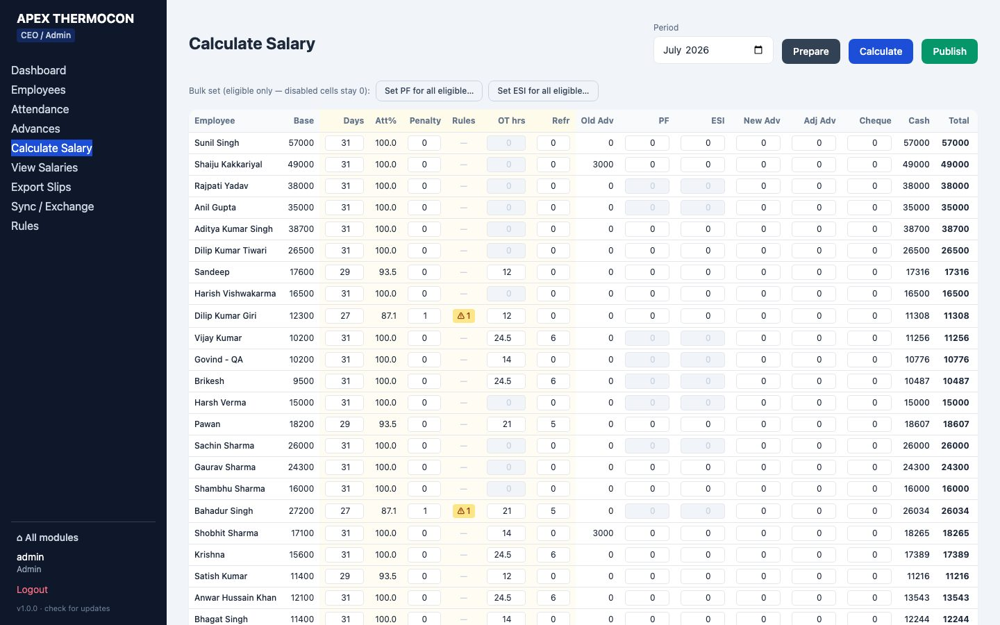

1. Pick the month and press **Prepare** — one row per employee, pre-filled from
   attendance. A ⚠ badge means a penalty rule fired (hover to see which days).
2. Every attendance number is **yours to adjust**: paid days, penalty days,
   OT hours, refreshment days.
3. Use **Set PF for all eligible…** / **Set ESI for all eligible…**, then
   fine-tune individuals. Enter advance recovery (*Adj Adv*) or fresh advances.
4. **Calculate** shows every total. Cash = Total − Cheque automatically.
5. **Publish** locks the month in: salaries recorded, advance ledgers posted,
   your adjustments written back. Re-publishing the same month overwrites it.

### 3.7 History and Excel sheets

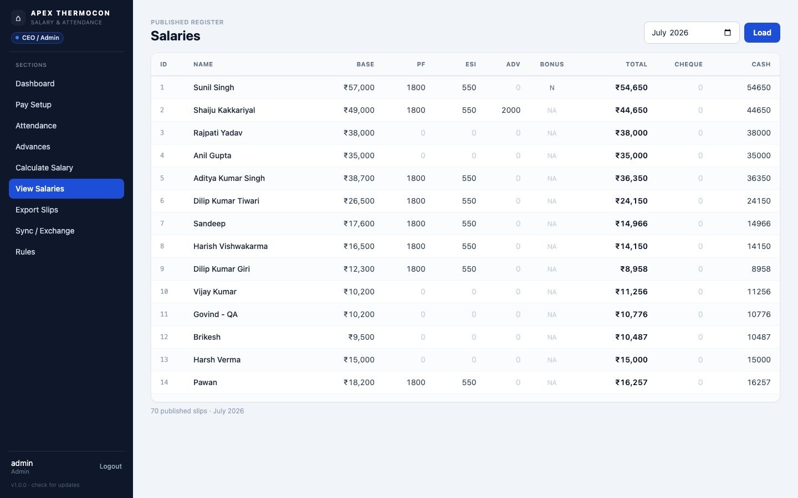

**View Salaries** lists any published month. **Export Slips** downloads the two
sheets the office already uses — the CEO reconciliation sheet and the
distribution slip:

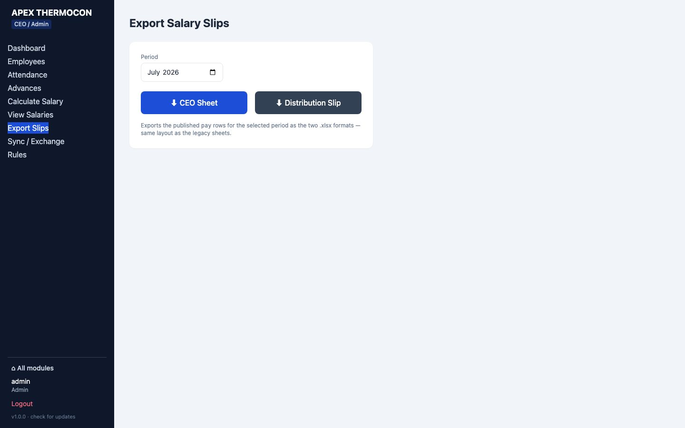

### 3.8 Salary rules

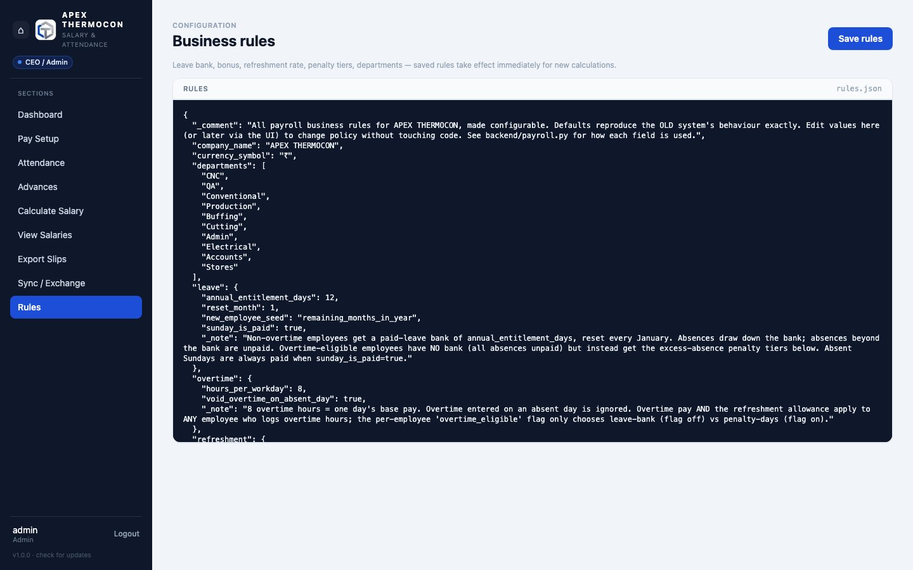

Leave entitlement, overtime rate, penalty tiers, the CNC bonus — all live here
and can be changed without touching the program. Careful: this is the raw
policy file; a friendlier Settings screen is planned.

---

## 4. Employee Management

Everything about your people that isn't money: profiles, documents, the leave
bank, and attendance summaries. Open the **👥 Employee Management** tile.

### 4.1 The roster

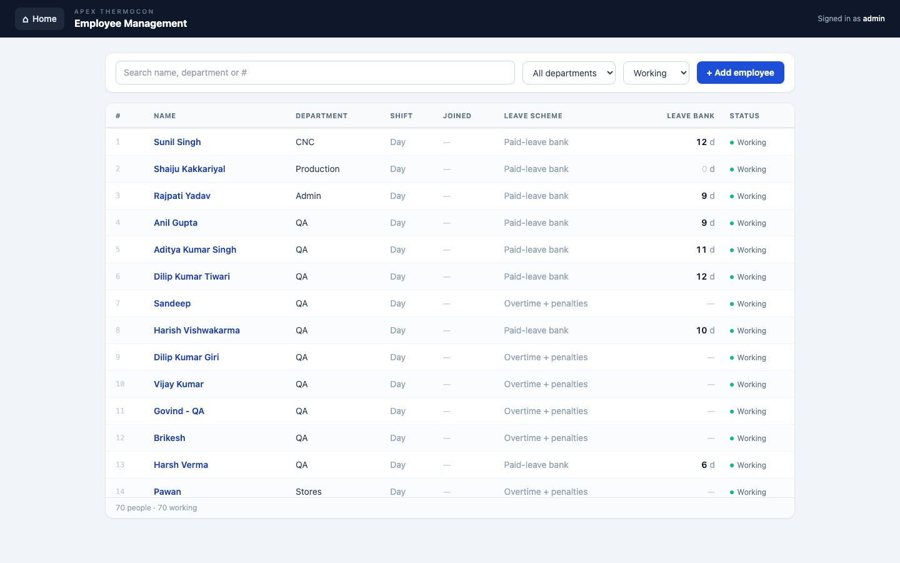

Search by name/department/number, filter by department or **Working / Left**.
Each row shows the shift, joining date, leave scheme and the leave bank.
Click a row to open the full record. **+ Add employee** creates a new person —
profile details plus a one-time *Starting pay* box (afterwards pay is managed
in Salary → Pay Setup).

### 4.2 One employee's record

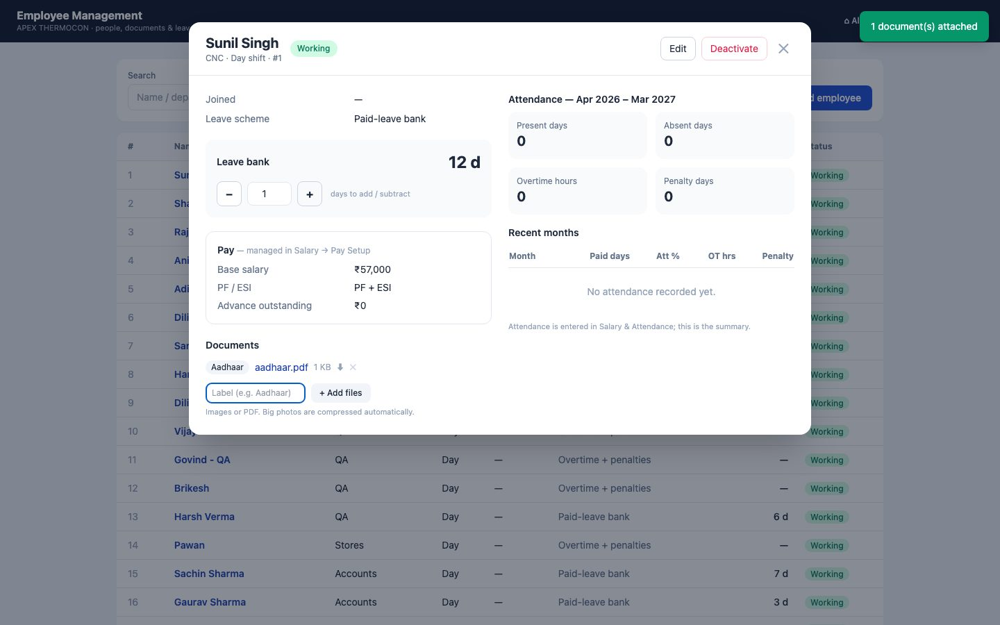

- **Leave bank** — the **+ / −** buttons add or subtract days (for example a
  compensatory day off, or a correction). The bank can never go below zero.
  Overtime-eligible workers have no bank — their absences follow the penalty
  rules at payroll time.
- **Documents** — upload Aadhaar cards, agreements, certificates (label them,
  then *+ Add files*). Photos from a phone are compressed automatically; click
  a name to view, ⬇ to download. Documents ride along in every backup.
- **Pay** — shown read-only here; change it in Salary → Pay Setup.
- **Attendance** — this financial year's totals and the last six months.
- **Deactivate** marks someone as left; history is always kept and they can be
  reactivated any time.

### 4.3 Editing a profile

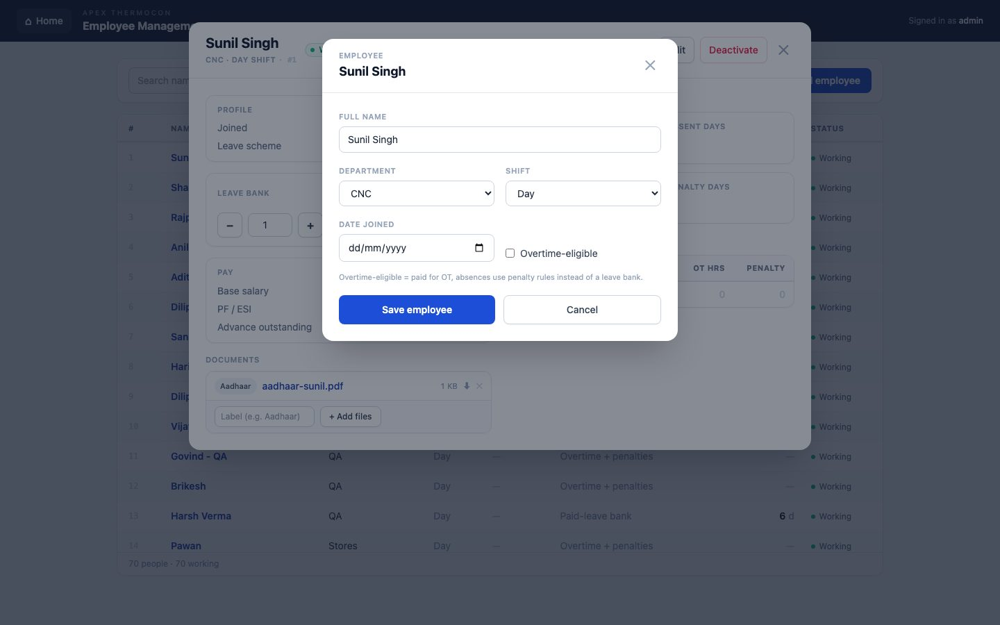

Name, department, shift, joining date, and the overtime-eligible flag (this
switches the leave scheme, so change it knowingly).

---

## 5. Raw Material Inventory

Every incoming batch of rods/bars is one **heat** — the number stamped on the
mill test certificate. The app tracks each heat from arrival to the orders it
fed.

### 5.1 The stock list

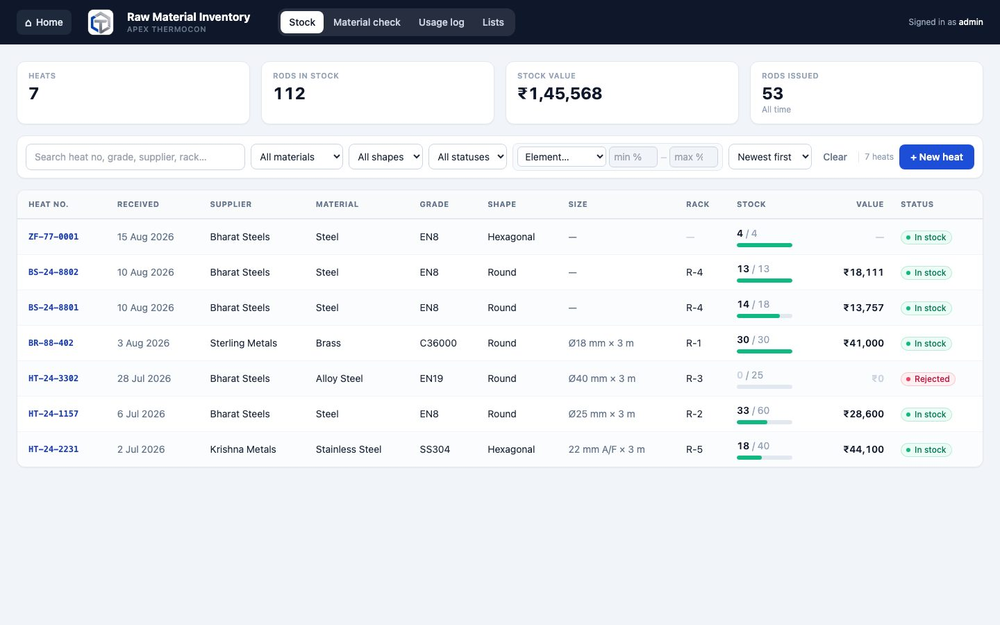

Top strip: total heats, rods in stock, stock value (₹), rods issued. Each row
shows **remaining/received** with a bar and a status: **In stock**,
**Consumed**, or **Rejected** (returned to supplier). Search by heat number,
grade, supplier or rack; filter by material, shape, status — or find steel by
its chemistry (e.g. Carbon 0.40–0.50%).

### 5.2 Adding a heat

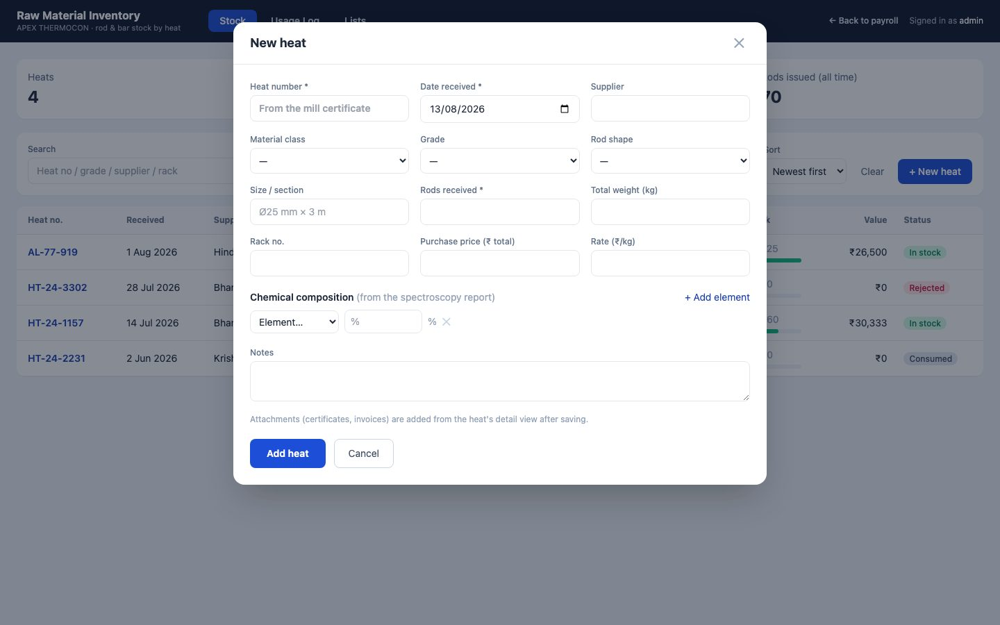

Copy the details straight off the mill certificate: heat number, supplier,
material/grade/shape (every dropdown has **+ Add new…** if a value is missing),
size, rods received, weight, price, and the chemistry rows from the
spectroscopy report. After saving, open the heat and attach photos or PDFs of
the certificate and purchase invoice — phone photos are compressed
automatically.

### 5.3 Using stock — the usage log

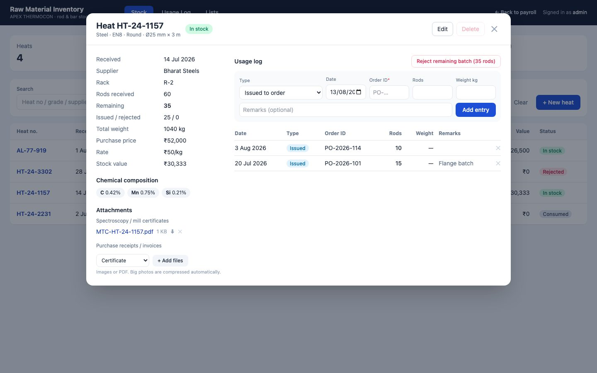

Open any heat to see its full story. To take rods out:
- **Issued to order** — enter the order/PO number (required) and how many rods.
- **Rejected → supplier** — for bad material; the red **Reject remaining
  batch** button returns everything left in one click.

The app refuses to issue more rods than remain. Deleting a log entry (✕) puts
the rods back — that's also how you undo a rejection.

### 5.4 Tracing an order

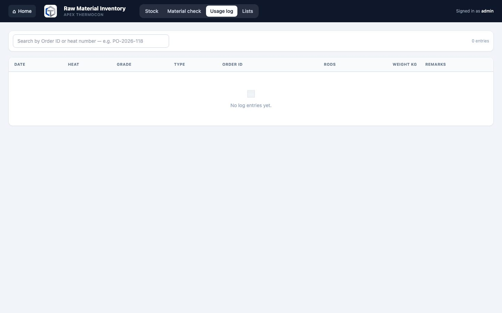

The **Usage Log** tab searches every movement by order number — type a PO
number and see exactly which heats (and therefore which mill certificates) fed
that order. That's your traceability answer when a customer asks.

### 5.5 Lists

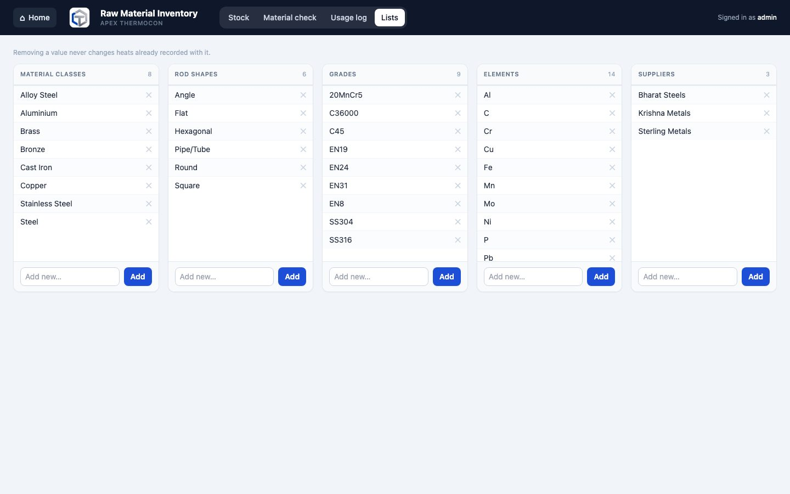

Material classes, shapes, grades and chemical elements are yours to manage.
Removing a value never changes heats already recorded with it.

---

## 6. Customers

Open the **🏢 Customers** tile. One record per customer: GSTIN, billing and
shipping addresses, payment terms, and the people you talk to.

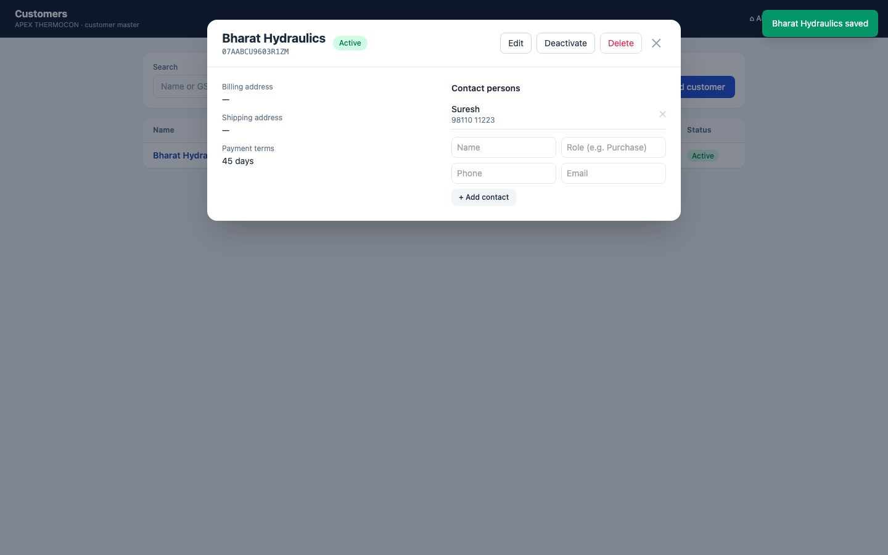

**+ Add customer** creates one; click a row for its record, where you add
contact persons (name, role, phone, email). Customers with orders or drawings
can be **deactivated** but never deleted — history stays intact.

Every customer gets a short **code** automatically: the initials of the name
plus a number, so Acme Castings becomes **AC01** and the next AC… customer
becomes **AC02**. "M/s", "Pvt", "Ltd" and similar words are ignored. If you'd
rather the initials were something else, type them in the form — the code
preview updates as you type. You can search the list by code, name or GSTIN.

The record has three tabs.

### 6.1 Business — what they're worth to you

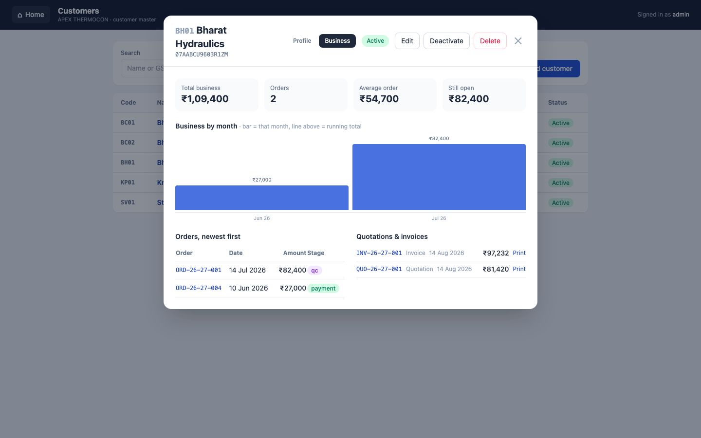

Lifetime total, number of orders, average order value and how much is still
open, then a **month-by-month bar chart** of business won — hover a bar to see
the running total to that month. Below it, every order newest-first with its
stage, and every quotation and invoice with a **Print** button, so any past
document can be reprinted from here without hunting for the original.

### 6.2 Rates — the prices you agreed with them

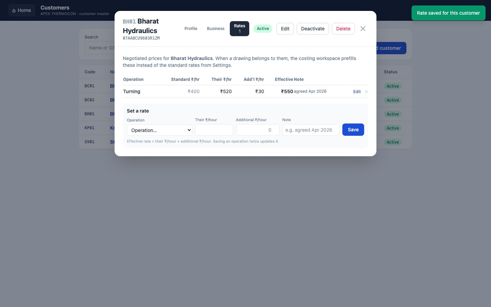

Most customers negotiate their own machining rates. Put them here once and every
part you price for that customer uses them automatically.

Pick the **Operation**, type **Their ₹/hour** (what this customer pays for it),
optionally an **Additional ₹/hour** on top, add a note like *"agreed Apr 2026"*
so you remember when it was settled, and press **Save**. The standard shop rate
from Settings is shown alongside, struck through, so you can see at a glance
what was negotiated.

- The **effective rate** is *their ₹/hour + additional ₹/hour*. In the picture,
  ₹520 + ₹30 = **₹550/hour**.
- Saving the same operation again updates it — you never get duplicate rows.
- Changing a rate here reprices every future costing for that customer in one
  edit. Costings you already saved keep the price they were saved with.

---

## 7. Parts & Pricing

Open the **📐 Parts & Pricing** tile — one record per customer drawing.

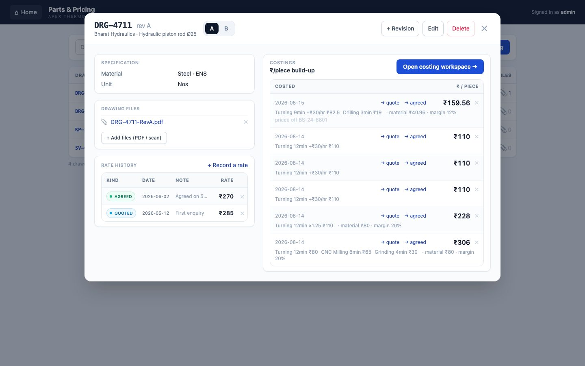

- **Drawing number + revision** identify the part; **+ Revision** starts a new
  revision (its rates and files begin fresh — pricing history is per revision).
- **Drawing files** — attach the PDF or a scan.
- **Rate history** answers "what did we charge last time": dated entries marked
  **quoted / agreed / revised**, newest first. The latest rate shows on the
  list and auto-fills order items.
- **Customer** — assign the drawing to a customer here. This is what makes the
  costing screen use that customer's agreed rates.

### 7.1 The costing workspace

**Open costing workspace** on a drawing gives pricing a full screen of its own.

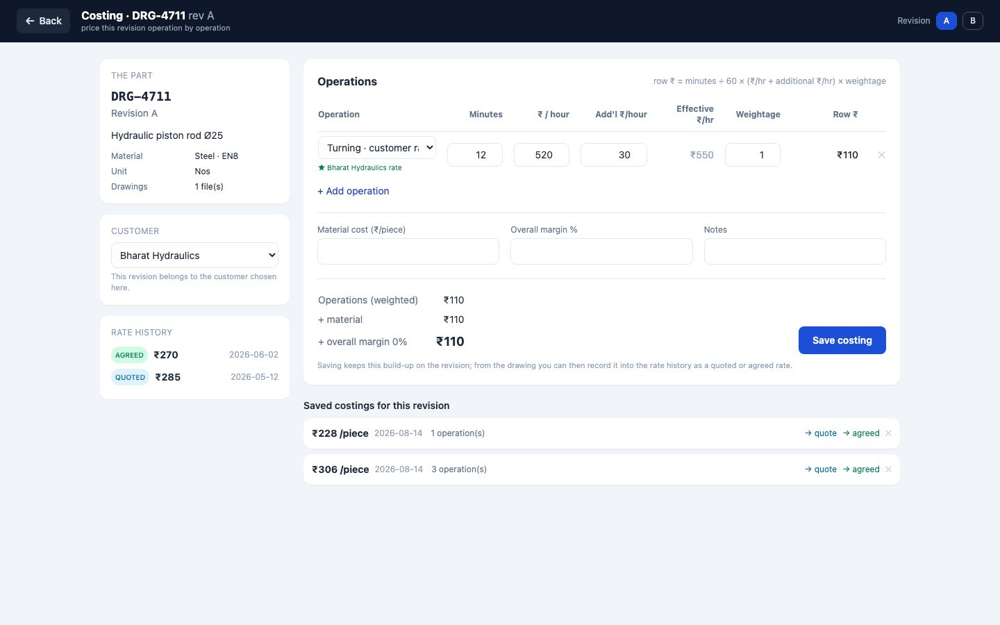

The part, its customer and its rate history sit on the left; the operations
table is on the right. Switch revisions with the **A / B** buttons at the top
right — each revision is priced separately.

Add a row per operation with **+ Add operation**, then fill in:

| Column | What to put in it |
| --- | --- |
| **Operation** | Pick from your Settings list. The rates fill in by themselves. |
| **Minutes** | Minutes this operation takes **per piece**. |
| **₹ / hour** | The hourly rate. Comes from Settings, or from the customer's agreed rate if they have one. |
| **Add'l ₹/hour** | Extra rupees per hour for this one operation — a better machine, a tighter tolerance, an awkward setup. |
| **Effective ₹/hr** | Calculated: ₹/hour + additional ₹/hour. Not editable. |
| **Weightage** | How much this operation counts relative to its clock time. Leave blank for normal (1). |
| **Row ₹** | Calculated: `minutes ÷ 60 × effective ₹/hr × weightage`. |

Everything recalculates as you type — there is no "calculate" button.

> **The additional margin is rupees per hour, not a percentage.** ₹520/hour with
> ₹30 additional means you are charging **₹550 an hour**, so 12 minutes costs
> ₹110. It sits in the same units as the rate next to it, so the two numbers are
> directly comparable.

**Weightage** is for work that is worth more than the stopwatch says. Setup time
spread across a batch, a second spindle running at the same time, an allowance
for scrap — put 1.5 and the row bills at one and a half times.

When the drawing belongs to a customer who has agreed rates, the row shows a
green **★ *customer* rate** badge and uses their price instead of the shop
standard. No badge means it's the standard Settings rate.

Below the table, add **material cost per piece** and an **overall margin %**;
the build-up on the right shows operations → + material → + margin → the final
₹/piece. **Save costing** stores it against the revision, and from the drawing
you can then push it into the rate history with **→ quote** or **→ agreed**.

A saved costing keeps the rates it was saved with. Changing a rate in Settings
or on the customer later will never quietly change a price you already quoted.

---

## 8. Order Tracking

Open the **🗂 Order Tracking** tile.

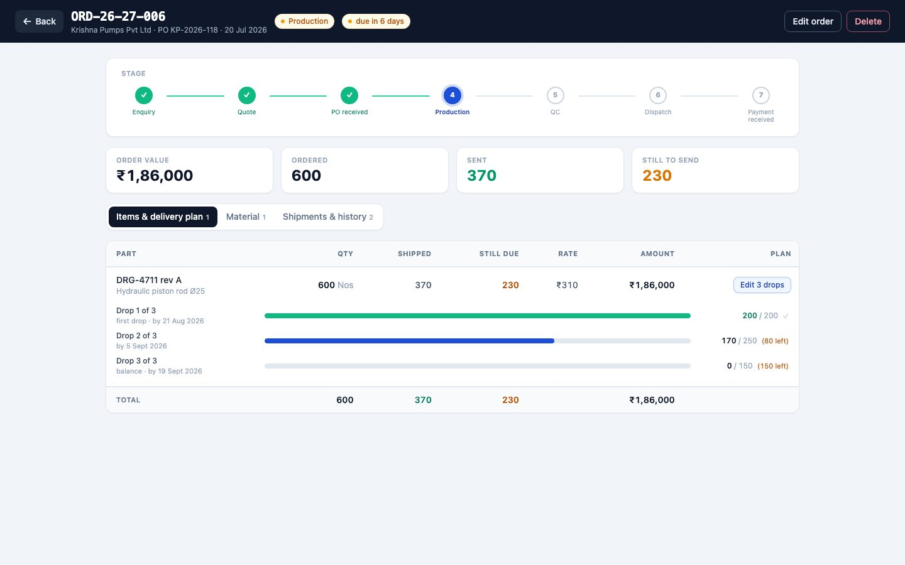

- **New order** — pick the customer, note their PO number, add items (picking
  a drawing fills the unit and its latest rate). The order number is automatic
  (format set in Settings) and restarts every financial year.
- **Stages** — Enquiry → Quote → PO received → Production → QC → Dispatch →
  Payment received. Click any stage to move there (skipping is fine); every
  move is logged with a note.
- **Material used** — rods issued in Inventory against this order number
  appear automatically, with their heat numbers: order → heat → mill
  certificate, the full traceability chain.
- **Shipping (consignments)** — press **🚚 Ship**:

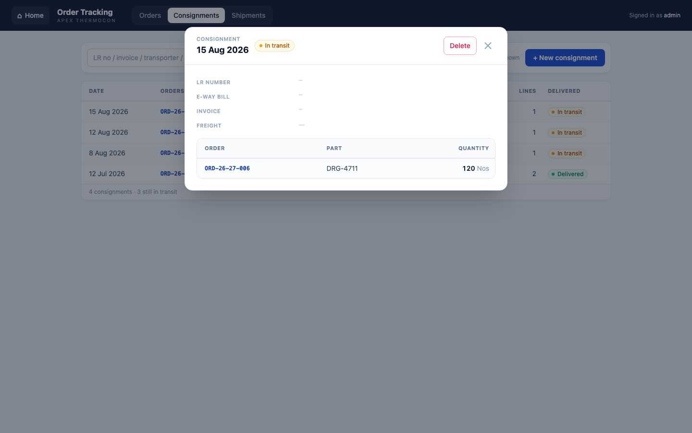

  Enter the GST paperwork (transporter, LR number, e-way bill, invoice,
  vehicle, freight) and the quantities going on this truck. **Partial
  shipments are fine**, and one consignment can carry items from **several
  orders** (type another order number and press *Add order*). The app refuses
  to ship more than an item has left. The **Consignments** tab lists every
  shipment — mark them **Delivered ✓** when confirmed.

---

## 9. Quotations & Invoices

Open the **🧾 Quotations & Invoices** tile. Both live here — a quotation is what
you send before the work, an invoice is what you send after it.

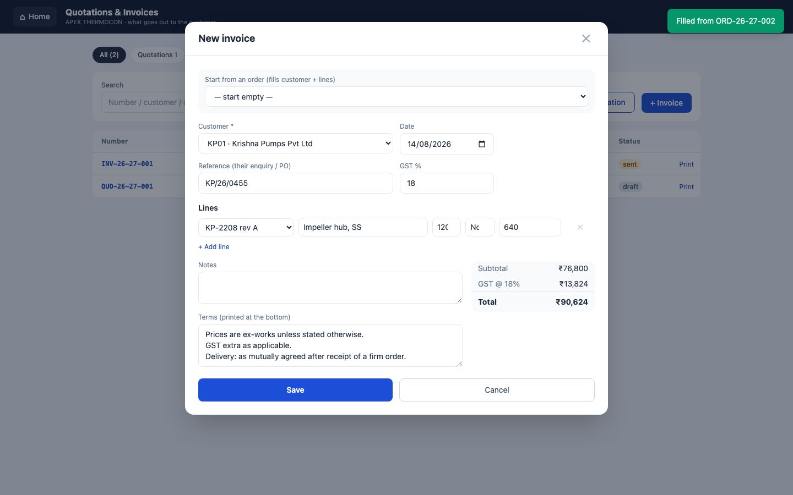

**+ Quotation** or **+ Invoice** starts one. Choose the customer and their
details fill in. Add a line per item: description, quantity, rate — the amount,
subtotal, GST and grand total all calculate themselves. For an invoice you can
pick an **order** instead and its items are copied in for you, so you are not
retyping what you already entered in Order Tracking.

Document numbers are issued automatically per financial year, and quotations and
invoices are numbered in separate series.

### 9.1 Printing and sending

**Print** opens a clean A4 copy in a new tab.

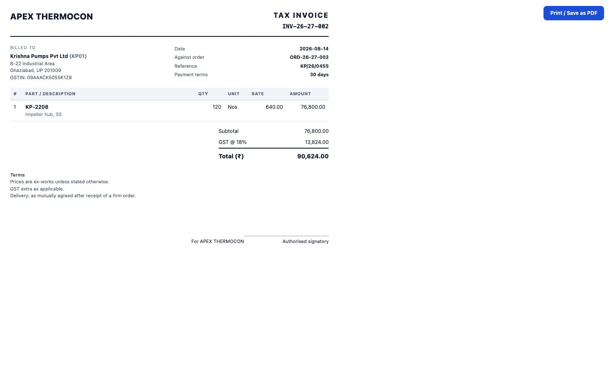

From there use your browser's print dialog — choose your printer for a paper
copy, or **Save as PDF** to get a file you can email or put on WhatsApp. There
is nothing extra to install.

Every document stays on the customer's **Business** tab too, so you can reprint
any past quotation or invoice from there at any time.

---

## 10. Settings

Open the **⚙ Settings** tile (changes are owner/admin only).

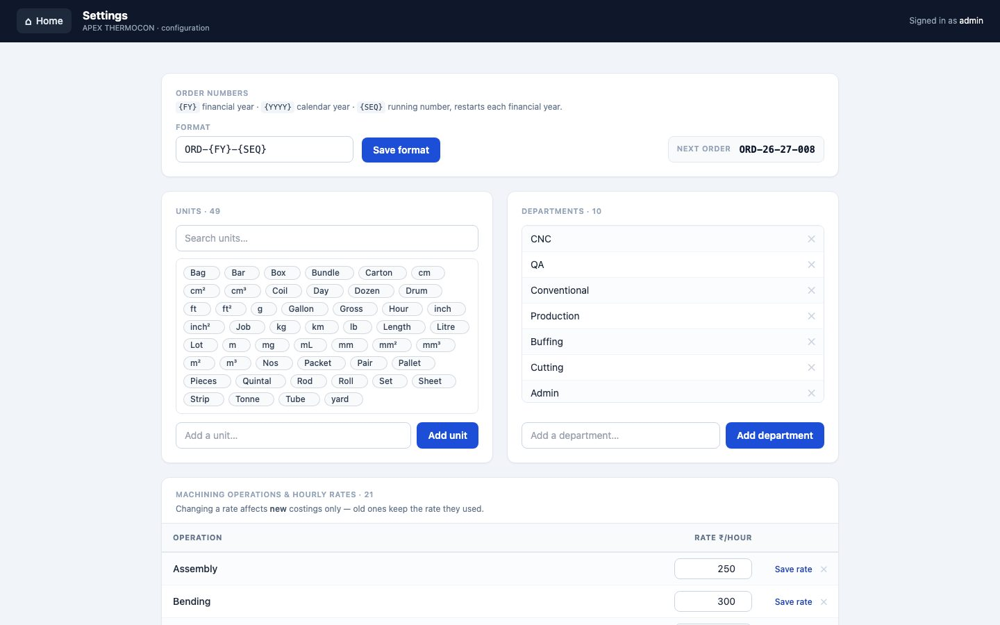

- **Order numbers** — the format template (`{FY}` financial year, `{SEQ}`
  running number) with a live preview of the next number.
- **Units** — the searchable list every unit dropdown uses.
- **Machining operations & hourly rates** — what the Parts costing builder
  charges per hour. Changing a rate affects new costings only.
- **Departments** — shared with employees and payroll.

---

## 11. Keeping your data safe

- **Back up regularly:** Salary & Attendance → Sync/Exchange → **Back up now**.
  Each backup is one `.zip` holding the entire database *and* every
  attachment (inventory certificates and employee documents). *Download a copy* saves it wherever you choose — keep one off the
  computer.
- **Restore:** unzip into the app's data folder (`%APPDATA%\APEX Payroll\`),
  replacing `salary.db` and **every** `*_files/` folder in the zip
  (`inventory_files/`, `employee_files/`, `drawing_files/`).
- **Updates:** when a new version is released, a popup offers it at sign-in —
  one click downloads, restarts, done. Your data is never touched. No popup =
  you're up to date (the `v1.x.x` label in the header checks on demand).

---

## 12. If something goes wrong

| Problem | What to do |
|---|---|
| Forgot a password | An administrator resets it in **Users & Access → Edit**. |
| "Only N rods remaining" | You tried to issue more than the heat has left — check the heat's usage log. |
| "Cheque + Cash must equal…" | The two amounts must add up to the total/advance exactly. |
| Attendance won't import | Only the **admin** machine imports attendance; only the **operator** machine imports the roster. Check you're on the right laptop. |
| A tile is missing | That account wasn't given access — the owner can grant it in **Users & Access**. |
| App window never opens | Rare: install Microsoft's WebView2 runtime (see DEPLOY.md), or the app opens in your browser instead. |

*Developer-facing documentation starts at [START_HERE.md](START_HERE.md).*
